# Summary
The general impression is, that the journals most of the time do not have a 
specific policy regarding the aspect under question, or it was unclear for our
reviewers if there was a policy or not or how to interpret it.

# Missing data
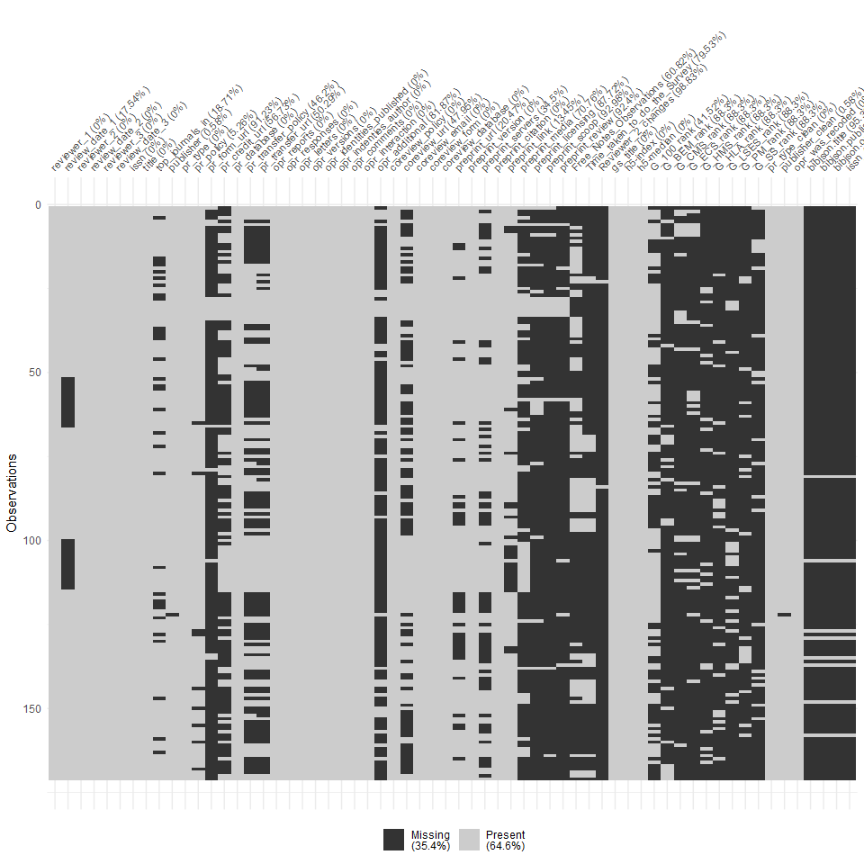<!-- -->

There is quite some missing data, which shouldn't be like this. For example
the field U30 in excel (table RAW), which has the opr-responses for the journal
"Advanced Materials" is missing. It should probably be "Not specified".

The following are all variables, where implicit missings should be checked and
converted to explicit ones (as for opr_responses), or fixed (as for publishers).

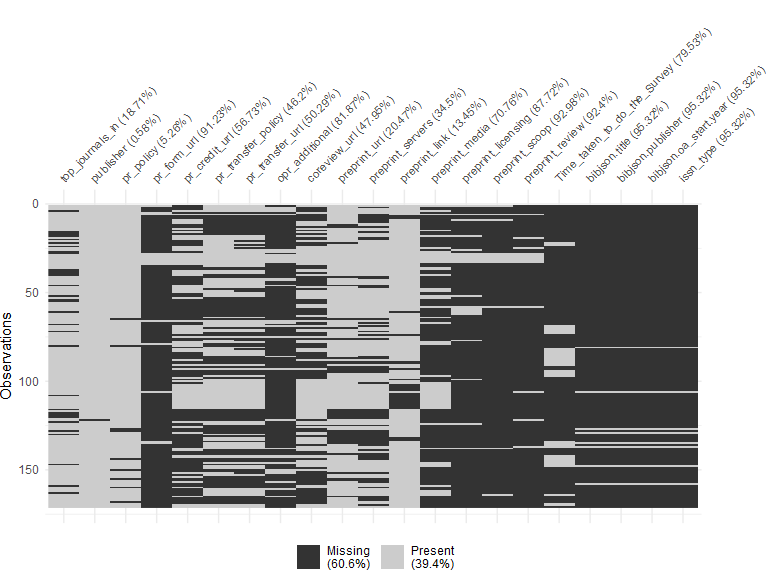<!-- -->

# Publisher versus subject area
The question is, whether it is reasonable to split results by publisher.
I think it does not make much sense:

- There are not many publishers, that have multiple publications
- Except Springer Nature and Elsevier, most publishers are confined to one or 
two subject areas. Looking at publishers would misinterprete differences as
being due to the publisher when they are due to the subject area.
- The only thing to compare would be thus Springer Nature vs. Elsevier


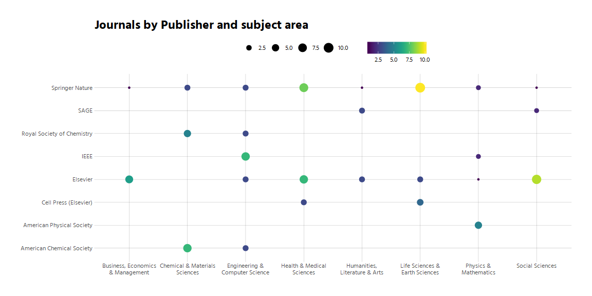<!-- -->


# Peer Review


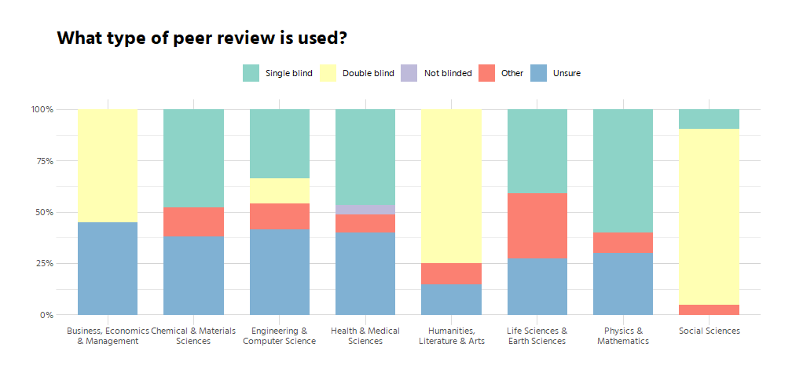<!-- -->


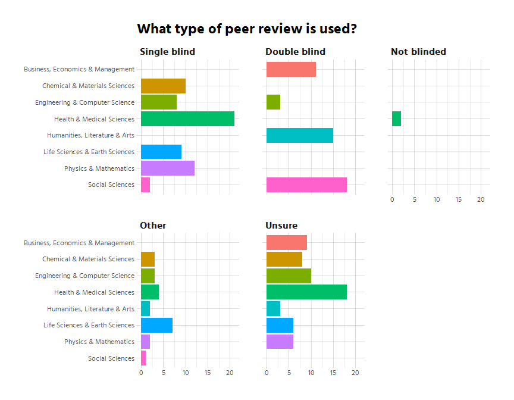<!-- -->


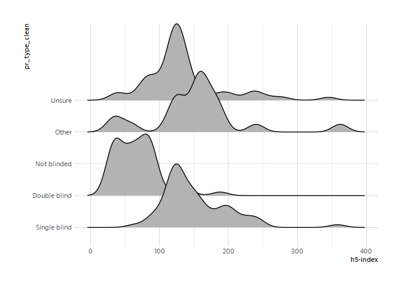<!-- -->


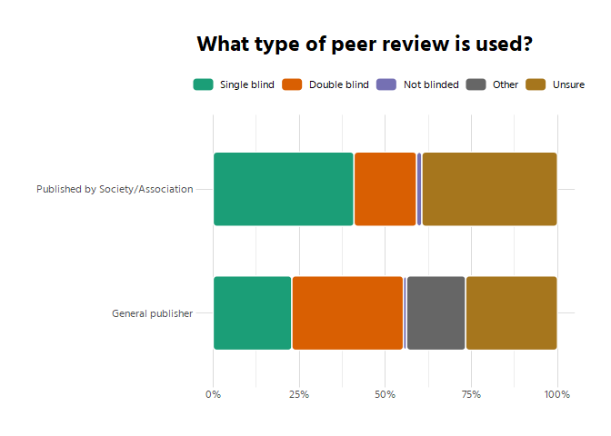<!-- -->

I don't think this distinction is very interesting, since it masks disciplinary
differences, which are more fundamental.

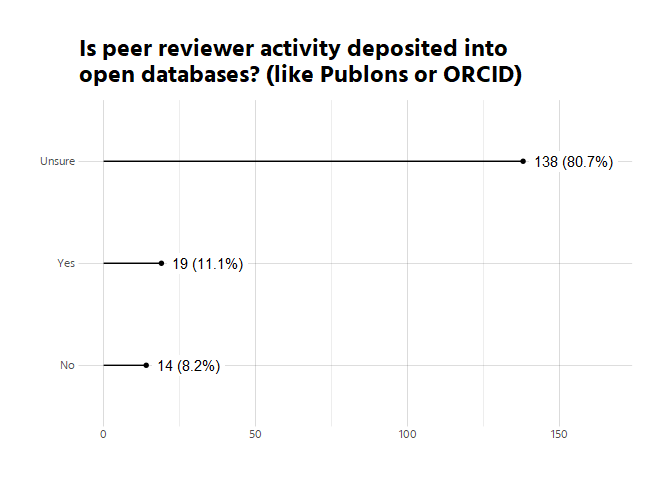<!-- -->


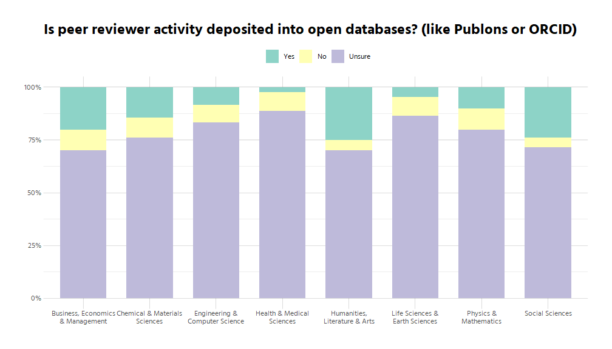<!-- -->


## Peer review transfer policy


Only 86 out of 171 do have a 
policy for manuscript transfer after rejection.
Due to policies being similar across journals of certain 
publishers, there are 48
distinct policies in our dataset.

The following table displays stemmed parts of the distinct policies, sorted by
propensity.
<div data-pagedtable="false">
  <script data-pagedtable-source type="application/json">
{"columns":[{"label":["word"],"name":[1],"type":["chr"],"align":["left"]},{"label":["n"],"name":[2],"type":["int"],"align":["right"]}],"data":[{"1":"journal","2":"160"},{"1":"review","2":"140"},{"1":"transfer","2":"116"},{"1":"manuscript","2":"87"},{"1":"editor","2":"52"},{"1":"author","2":"51"},{"1":"paper","2":"39"},{"1":"submiss","2":"37"},{"1":"articl","2":"36"},{"1":"peer","2":"26"},{"1":"decis","2":"22"},{"1":"comment","2":"21"},{"1":"ac","2":"20"},{"1":"physic","2":"18"},{"1":"receiv","2":"17"},{"1":"suitabl","2":"17"},{"1":"file","2":"16"},{"1":"ident","2":"16"},{"1":"process","2":"16"},{"1":"public","2":"16"},{"1":"reject","2":"16"},{"1":"servic","2":"16"},{"1":"submit","2":"16"},{"1":"offer","2":"14"},{"1":"report","2":"14"},{"1":"share","2":"13"},{"1":"accept","2":"12"},{"1":"consider","2":"12"},{"1":"letter","2":"12"},{"1":"option","2":"12"},{"1":"declin","2":"11"},{"1":"inform","2":"11"},{"1":"question","2":"11"},{"1":"time","2":"11"},{"1":"addit","2":"10"},{"1":"cell","2":"10"},{"1":"editori","2":"10"},{"1":"note","2":"10"},{"1":"press","2":"10"},{"1":"publish","2":"10"},{"1":"reformat","2":"10"},{"1":"intern","2":"9"},{"1":"bmj","2":"8"},{"1":"refere","2":"8"},{"1":"research","2":"8"},{"1":"agre","2":"7"},{"1":"editor’","2":"7"},{"1":"suggest","2":"7"},{"1":"automat","2":"6"},{"1":"choic","2":"6"},{"1":"contact","2":"6"},{"1":"cover","2":"6"},{"1":"lancet","2":"6"},{"1":"pass","2":"6"},{"1":"revis","2":"6"},{"1":"scienc","2":"6"},{"1":"behalf","2":"5"},{"1":"edit","2":"5"},{"1":"evalu","2":"5"},{"1":"feel","2":"5"},{"1":"free","2":"5"},{"1":"heliyon","2":"5"},{"1":"independ","2":"5"},{"1":"opportun","2":"5"},{"1":"partner","2":"5"},{"1":"pediatr","2":"5"},{"1":"provid","2":"5"},{"1":"reach","2":"5"},{"1":"refer","2":"5"},{"1":"relev","2":"5"},{"1":"respons","2":"5"},{"1":"restart","2":"5"},{"1":"resubmit","2":"5"},{"1":"seek","2":"5"},{"1":"societi","2":"5"},{"1":"access","2":"4"},{"1":"advanc","2":"4"},{"1":"aip","2":"4"},{"1":"base","2":"4"},{"1":"elsevi","2":"4"},{"1":"exist","2":"4"},{"1":"extern","2":"4"},{"1":"famili","2":"4"},{"1":"gastroenterologi","2":"4"},{"1":"hospit","2":"4"},{"1":"includ","2":"4"},{"1":"initi","2":"4"},{"1":"judg","2":"4"},{"1":"mean","2":"4"},{"1":"mention","2":"4"},{"1":"onlin","2":"4"},{"1":"particip","2":"4"},{"1":"plo","2":"4"},{"1":"polici","2":"4"},{"1":"requir","2":"4"},{"1":"shorten","2":"4"},{"1":"target","2":"4"},{"1":"topic","2":"4"},{"1":"aacr","2":"3"},{"1":"assess","2":"3"},{"1":"awar","2":"3"},{"1":"chanc","2":"3"},{"1":"chemistri","2":"3"},{"1":"coauthor","2":"3"},{"1":"consent","2":"3"},{"1":"consum","2":"3"},{"1":"copi","2":"3"},{"1":"deem","2":"3"},{"1":"easili","2":"3"},{"1":"elsevier’","2":"3"},{"1":"faq","2":"3"},{"1":"final","2":"3"},{"1":"guarante","2":"3"},{"1":"http","2":"3"},{"1":"multipl","2":"3"},{"1":"name","2":"3"},{"1":"natur","2":"3"},{"1":"nomin","2":"3"},{"1":"occasion","2":"3"},{"1":"paragon","2":"3"},{"1":"portfolio","2":"3"},{"1":"quickli","2":"3"},{"1":"reason","2":"3"},{"1":"reduc","2":"3"},{"1":"regular","2":"3"},{"1":"royal","2":"3"},{"1":"scope","2":"3"},{"1":"select","2":"3"},{"1":"serial","2":"3"},{"1":"simplifi","2":"3"},{"1":"system","2":"3"},{"1":"team","2":"3"},{"1":"upload","2":"3"},{"1":"ad","2":"2"},{"1":"anonym","2":"2"},{"1":"author’","2":"2"},{"1":"belong","2":"2"},{"1":"choos","2":"2"},{"1":"consid","2":"2"},{"1":"depend","2":"2"},{"1":"detail","2":"2"},{"1":"disciplin","2":"2"},{"1":"draft","2":"2"},{"1":"elect","2":"2"},{"1":"entir","2":"2"},{"1":"esc","2":"2"},{"1":"excel","2":"2"},{"1":"expert","2":"2"},{"1":"fast","2":"2"},{"1":"feedback","2":"2"},{"1":"heliyon’","2":"2"},{"1":"identifi","2":"2"},{"1":"invit","2":"2"},{"1":"jama","2":"2"},{"1":"journal'","2":"2"},{"1":"materi","2":"2"},{"1":"permiss","2":"2"},{"1":"purview","2":"2"},{"1":"qualiti","2":"2"},{"1":"recommend","2":"2"},{"1":"relationship","2":"2"},{"1":"request","2":"2"},{"1":"result","2":"2"},{"1":"reveal","2":"2"},{"1":"send","2":"2"},{"1":"specialti","2":"2"},{"1":"stai","2":"2"},{"1":"suit","2":"2"},{"1":"summari","2":"2"},{"1":"titl","2":"2"},{"1":"undergo","2":"2"},{"1":"version","2":"2"},{"1":"visibl","2":"2"},{"1":"1","2":"1"},{"1":"14","2":"1"},{"1":"2","2":"1"},{"1":"aap.org","2":"1"},{"1":"address","2":"1"},{"1":"adv","2":"1"},{"1":"aip.scitation.org","2":"1"},{"1":"allow","2":"1"},{"1":"altern","2":"1"},{"1":"apl","2":"1"},{"1":"applic","2":"1"},{"1":"assist","2":"1"},{"1":"at","2":"1"},{"1":"author'","2":"1"},{"1":"authors.bmj.com","2":"1"},{"1":"avoid","2":"1"},{"1":"basi","2":"1"},{"1":"benefit","2":"1"},{"1":"board","2":"1"},{"1":"british","2":"1"},{"1":"broader","2":"1"},{"1":"burden","2":"1"},{"1":"cascad","2":"1"},{"1":"cellpress","2":"1"},{"1":"challeng","2":"1"},{"1":"check","2":"1"},{"1":"complet","2":"1"},{"1":"concis","2":"1"},{"1":"condit","2":"1"},{"1":"confid","2":"1"},{"1":"confidenti","2":"1"},{"1":"confirm","2":"1"},{"1":"conflict","2":"1"},{"1":"conform","2":"1"},{"1":"consult","2":"1"},{"1":"conveni","2":"1"},{"1":"cosubmiss","2":"1"},{"1":"criteria","2":"1"},{"1":"critic","2":"1"},{"1":"dai","2":"1"},{"1":"decid","2":"1"},{"1":"delai","2":"1"},{"1":"desk","2":"1"},{"1":"direct","2":"1"},{"1":"discuss","2":"1"},{"1":"disposit","2":"1"},{"1":"download","2":"1"},{"1":"ebiomedicin","2":"1"},{"1":"econometr","2":"1"},{"1":"econometrica","2":"1"},{"1":"elsevier'","2":"1"},{"1":"email","2":"1"},{"1":"encourag","2":"1"},{"1":"estim","2":"1"},{"1":"expect","2":"1"},{"1":"facil","2":"1"},{"1":"fit","2":"1"},{"1":"flagship","2":"1"},{"1":"forward","2":"1"},{"1":"freeli","2":"1"},{"1":"frontlin","2":"1"},{"1":"fulfil","2":"1"},{"1":"guid","2":"1"},{"1":"guidelin","2":"1"},{"1":"gut","2":"1"},{"1":"happi","2":"1"},{"1":"hepatologi","2":"1"},{"1":"home","2":"1"},{"1":"honor","2":"1"},{"1":"i.","2":"1"},{"1":"ii","2":"1"},{"1":"iii","2":"1"},{"1":"indic","2":"1"},{"1":"individu","2":"1"},{"1":"instruct","2":"1"},{"1":"intend","2":"1"},{"1":"iop","2":"1"},{"1":"iv","2":"1"},{"1":"joint","2":"1"},{"1":"link","2":"1"},{"1":"list","2":"1"},{"1":"mind","2":"1"},{"1":"model","2":"1"},{"1":"month","2":"1"},{"1":"network","2":"1"},{"1":"neurologi","2":"1"},{"1":"occas","2":"1"},{"1":"occur","2":"1"},{"1":"offic","2":"1"},{"1":"oncologi","2":"1"},{"1":"opinion","2":"1"},{"1":"pdf","2":"1"},{"1":"pediatricseditori","2":"1"},{"1":"pediatricsreview","2":"1"},{"1":"person","2":"1"},{"1":"preselect","2":"1"},{"1":"primarili","2":"1"},{"1":"proce","2":"1"},{"1":"procedur","2":"1"},{"1":"rare","2":"1"},{"1":"readi","2":"1"},{"1":"realiz","2":"1"},{"1":"reconsid","2":"1"},{"1":"relat","2":"1"},{"1":"resubmiss","2":"1"},{"1":"save","2":"1"},{"1":"scientif","2":"1"},{"1":"sign","2":"1"},{"1":"spend","2":"1"},{"1":"stringent","2":"1"},{"1":"subscript","2":"1"},{"1":"subsequ","2":"1"},{"1":"success","2":"1"},{"1":"supplementari","2":"1"},{"1":"support","2":"1"},{"1":"technic","2":"1"},{"1":"term","2":"1"},{"1":"transmit","2":"1"},{"1":"trust","2":"1"},{"1":"twofold","2":"1"},{"1":"typic","2":"1"},{"1":"unmatch","2":"1"},{"1":"unsuccess","2":"1"},{"1":"unsur","2":"1"},{"1":"vet","2":"1"},{"1":"visit","2":"1"},{"1":"write","2":"1"},{"1":"www.bmj.com","2":"1"}],"options":{"columns":{"min":{},"max":[10]},"rows":{"min":[10],"max":[10]},"pages":{}}}
  </script>
</div>


The following graph shows the relationship between to most common bigrams (only
bigrams that occur at least three times).

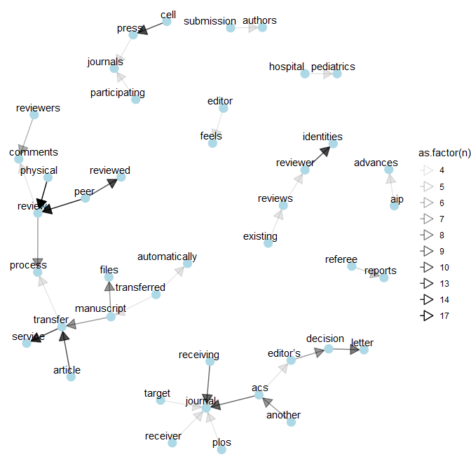<!-- -->


# Open Peer Review
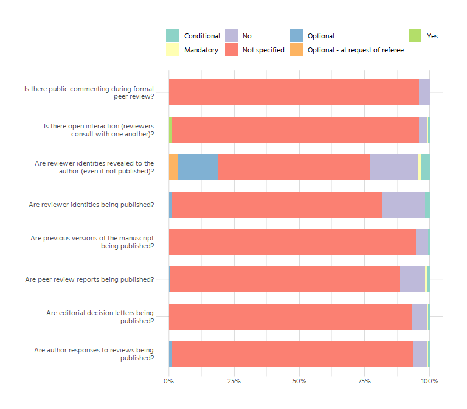<!-- -->

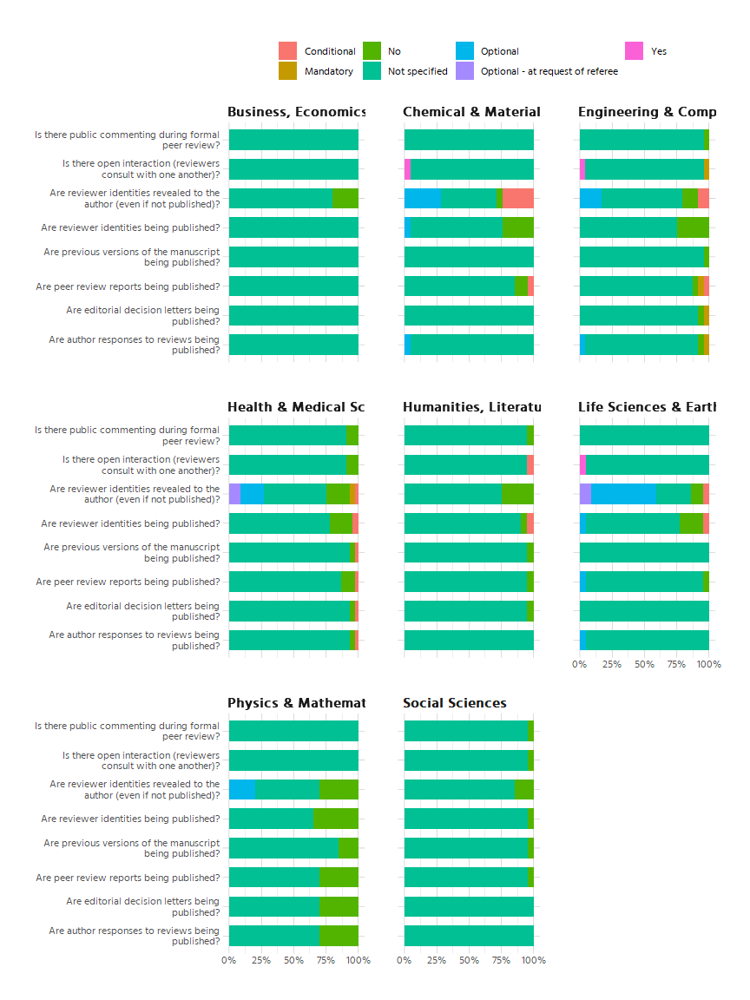<!-- -->


# Co-Review
Let's look at the co-review policy.


Only 87 out of 171 do have a 
coreview-policy. Due to policies being similar across journals of certain 
publishers, there are 45
distinct policies in our dataset.

The following table displays stemmed parts of the distinct policies, sorted by
propensity.
<div data-pagedtable="false">
  <script data-pagedtable-source type="application/json">
{"columns":[{"label":["word"],"name":[1],"type":["chr"],"align":["left"]},{"label":["n"],"name":[2],"type":["int"],"align":["right"]}],"data":[{"1":"review","2":"135"},{"1":"manuscript","2":"53"},{"1":"editor","2":"44"},{"1":"confidenti","2":"34"},{"1":"inform","2":"25"},{"1":"colleagu","2":"21"},{"1":"involv","2":"17"},{"1":"journal","2":"17"},{"1":"consult","2":"15"},{"1":"discuss","2":"15"},{"1":"disclos","2":"14"},{"1":"permiss","2":"14"},{"1":"student","2":"14"},{"1":"author","2":"13"},{"1":"peer","2":"13"},{"1":"process","2":"12"},{"1":"ensur","2":"11"},{"1":"obtain","2":"11"},{"1":"person","2":"11"},{"1":"accept","2":"10"},{"1":"advic","2":"10"},{"1":"collabor","2":"10"},{"1":"share","2":"10"},{"1":"submit","2":"10"},{"1":"ident","2":"9"},{"1":"includ","2":"9"},{"1":"paper","2":"9"},{"1":"treat","2":"9"},{"1":"content","2":"8"},{"1":"expect","2":"8"},{"1":"laboratori","2":"8"},{"1":"refere","2":"8"},{"1":"specif","2":"8"},{"1":"commun","2":"7"},{"1":"contact","2":"7"},{"1":"guidelin","2":"7"},{"1":"publish","2":"7"},{"1":"research","2":"7"},{"1":"traine","2":"7"},{"1":"addit","2":"6"},{"1":"comment","2":"6"},{"1":"conflict","2":"6"},{"1":"document","2":"6"},{"1":"invit","2":"6"},{"1":"maintain","2":"6"},{"1":"prior","2":"6"},{"1":"request","2":"6"},{"1":"respons","2":"6"},{"1":"special","2":"6"},{"1":"articl","2":"5"},{"1":"e.g","2":"5"},{"1":"ethic","2":"5"},{"1":"evalu","2":"5"},{"1":"event","2":"5"},{"1":"instanc","2":"5"},{"1":"junior","2":"5"},{"1":"name","2":"5"},{"1":"parti","2":"5"},{"1":"potenti","2":"5"},{"1":"record","2":"5"},{"1":"report","2":"5"},{"1":"sought","2":"5"},{"1":"unpublish","2":"5"},{"1":"abid","2":"4"},{"1":"advanc","2":"4"},{"1":"agre","2":"4"},{"1":"copi","2":"4"},{"1":"experi","2":"4"},{"1":"expert","2":"4"},{"1":"graduat","2":"4"},{"1":"help","2":"4"},{"1":"identifi","2":"4"},{"1":"individu","2":"4"},{"1":"mentor","2":"4"},{"1":"profession","2":"4"},{"1":"receiv","2":"4"},{"1":"requir","2":"4"},{"1":"shown","2":"4"},{"1":"write","2":"4"},{"1":"account","2":"3"},{"1":"accur","2":"3"},{"1":"accuraci","2":"3"},{"1":"compon","2":"3"},{"1":"confid","2":"3"},{"1":"cope","2":"3"},{"1":"doc","2":"3"},{"1":"editori","2":"3"},{"1":"exist","2":"3"},{"1":"feel","2":"3"},{"1":"handl","2":"3"},{"1":"input","2":"3"},{"1":"learn","2":"3"},{"1":"materi","2":"3"},{"1":"minimum","2":"3"},{"1":"note","2":"3"},{"1":"opportun","2":"3"},{"1":"origin","2":"3"},{"1":"permit","2":"3"},{"1":"post","2":"3"},{"1":"practic","2":"3"},{"1":"privileg","2":"3"},{"1":"reflect","2":"3"},{"1":"scientif","2":"3"},{"1":"submiss","2":"3"},{"1":"ultim","2":"3"},{"1":"violat","2":"3"},{"1":"assist","2":"2"},{"1":"avoid","2":"2"},{"1":"awar","2":"2"},{"1":"check","2":"2"},{"1":"choos","2":"2"},{"1":"club","2":"2"},{"1":"committe","2":"2"},{"1":"compet","2":"2"},{"1":"declar","2":"2"},{"1":"difficult","2":"2"},{"1":"divulg","2":"2"},{"1":"encourag","2":"2"},{"1":"exclud","2":"2"},{"1":"exercis","2":"2"},{"1":"financi","2":"2"},{"1":"found","2":"2"},{"1":"function","2":"2"},{"1":"make","2":"2"},{"1":"meet","2":"2"},{"1":"natur","2":"2"},{"1":"offic","2":"2"},{"1":"opinion","2":"2"},{"1":"outlin","2":"2"},{"1":"provid","2":"2"},{"1":"public","2":"2"},{"1":"refrain","2":"2"},{"1":"restrict","2":"2"},{"1":"seek","2":"2"},{"1":"senior","2":"2"},{"1":"strictli","2":"2"},{"1":"subject","2":"2"},{"1":"supervisor","2":"2"},{"1":"time","2":"2"},{"1":"train","2":"2"},{"1":"websit","2":"2"},{"1":"06","2":"1"},{"1":"11","2":"1"},{"1":"14","2":"1"},{"1":"29","2":"1"},{"1":"abstract","2":"1"},{"1":"acknowledg","2":"1"},{"1":"acquir","2":"1"},{"1":"advantag","2":"1"},{"1":"agu’","2":"1"},{"1":"ahead","2":"1"},{"1":"aid","2":"1"},{"1":"allow","2":"1"},{"1":"amr","2":"1"},{"1":"annal","2":"1"},{"1":"anonym","2":"1"},{"1":"another’","2":"1"},{"1":"approv","2":"1"},{"1":"argument","2":"1"},{"1":"aspect","2":"1"},{"1":"assign","2":"1"},{"1":"associ","2":"1"},{"1":"assumpt","2":"1"},{"1":"belief","2":"1"},{"1":"benefit","2":"1"},{"1":"board","2":"1"},{"1":"breach","2":"1"},{"1":"can’t","2":"1"},{"1":"career","2":"1"},{"1":"circumst","2":"1"},{"1":"citat","2":"1"},{"1":"complet","2":"1"},{"1":"consent","2":"1"},{"1":"contain","2":"1"},{"1":"contribut","2":"1"},{"1":"correspond","2":"1"},{"1":"data","2":"1"},{"1":"decis","2":"1"},{"1":"deleg","2":"1"},{"1":"deserv","2":"1"},{"1":"design","2":"1"},{"1":"destroi","2":"1"},{"1":"directli","2":"1"},{"1":"disadvantag","2":"1"},{"1":"disclosur","2":"1"},{"1":"discredit","2":"1"},{"1":"dissemin","2":"1"},{"1":"doctor","2":"1"},{"1":"due","2":"1"},{"1":"editor’","2":"1"},{"1":"effort","2":"1"},{"1":"enlist","2":"1"},{"1":"expertis","2":"1"},{"1":"explicit","2":"1"},{"1":"facilit","2":"1"},{"1":"fairli","2":"1"},{"1":"field","2":"1"},{"1":"file","2":"1"},{"1":"find","2":"1"},{"1":"free","2":"1"},{"1":"gain","2":"1"},{"1":"guid","2":"1"},{"1":"guidanc","2":"1"},{"1":"idea","2":"1"},{"1":"incorpor","2":"1"},{"1":"infer","2":"1"},{"1":"intellectu","2":"1"},{"1":"intern","2":"1"},{"1":"interpret","2":"1"},{"1":"jci","2":"1"},{"1":"journal’","2":"1"},{"1":"lead","2":"1"},{"1":"manner","2":"1"},{"1":"matter","2":"1"},{"1":"mean","2":"1"},{"1":"medicin","2":"1"},{"1":"method","2":"1"},{"1":"necess","2":"1"},{"1":"notif","2":"1"},{"1":"oup","2":"1"},{"1":"perform","2":"1"},{"1":"polici","2":"1"},{"1":"preserv","2":"1"},{"1":"previous","2":"1"},{"1":"principl","2":"1"},{"1":"privat","2":"1"},{"1":"proceed","2":"1"},{"1":"professor","2":"1"},{"1":"prohibit","2":"1"},{"1":"properti","2":"1"},{"1":"protect","2":"1"},{"1":"publicli","2":"1"},{"1":"purpos","2":"1"},{"1":"qualifi","2":"1"},{"1":"qualiti","2":"1"},{"1":"reason","2":"1"},{"1":"recogn","2":"1"},{"1":"recognit","2":"1"},{"1":"recus","2":"1"},{"1":"referee'","2":"1"},{"1":"referee’","2":"1"},{"1":"relat","2":"1"},{"1":"relationship","2":"1"},{"1":"relax","2":"1"},{"1":"resid","2":"1"},{"1":"respect","2":"1"},{"1":"rest","2":"1"},{"1":"scholar","2":"1"},{"1":"sign","2":"1"},{"1":"signific","2":"1"},{"1":"singl","2":"1"},{"1":"site","2":"1"},{"1":"staff","2":"1"},{"1":"strict","2":"1"},{"1":"strong","2":"1"},{"1":"understand","2":"1"},{"1":"uphold","2":"1"},{"1":"wish","2":"1"},{"1":"written","2":"1"},{"1":"you’d","2":"1"}],"options":{"columns":{"min":{},"max":[10]},"rows":{"min":[10],"max":[10]},"pages":{}}}
  </script>
</div>


The following graph shows the relationship between to most common bigrams (only
bigrams that occur at least three times).

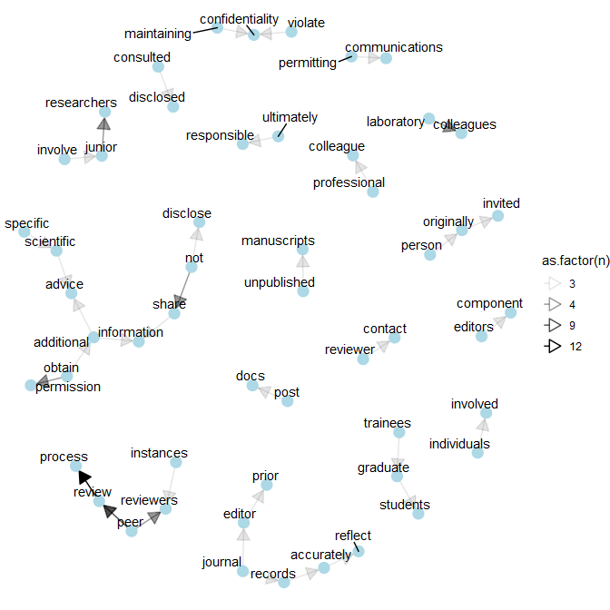<!-- -->


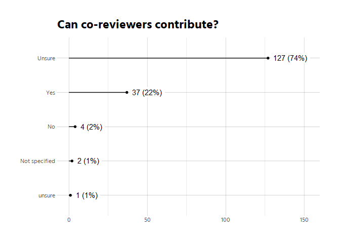<!-- -->

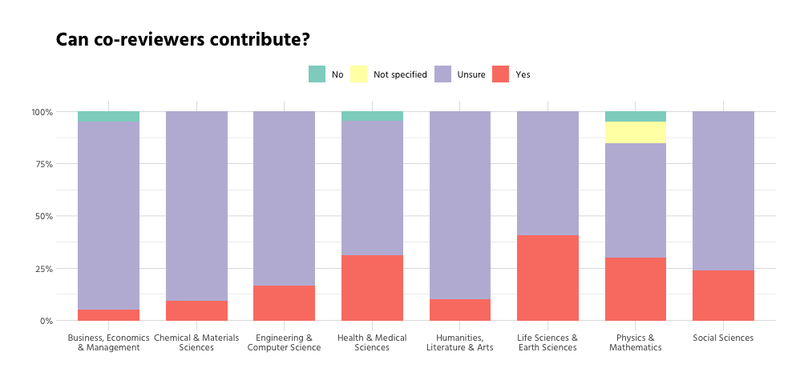<!-- -->


This doesn't look interesting.
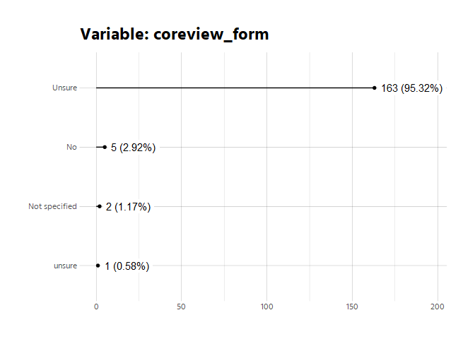<!-- -->

This doesn't look interesting.
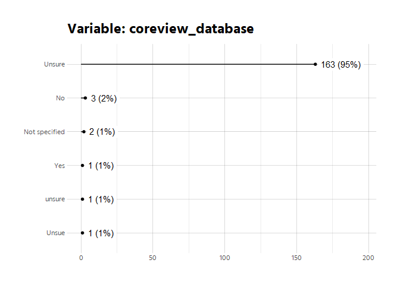<!-- -->

# Preprints
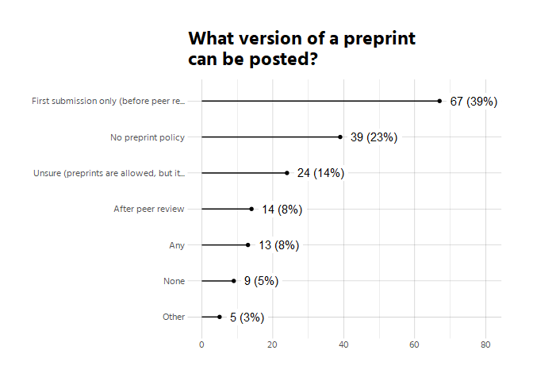<!-- -->

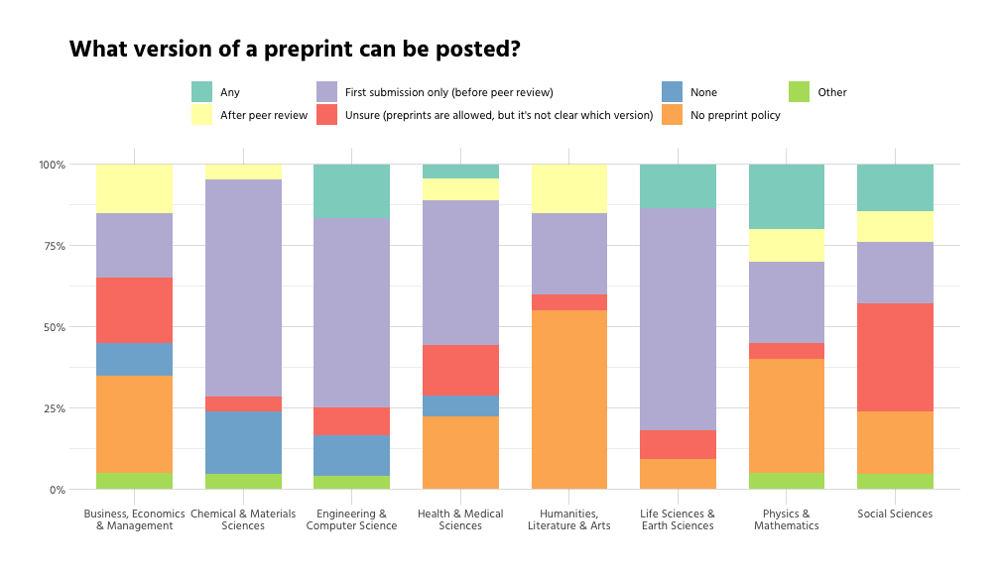<!-- -->


<div data-pagedtable="false">
  <script data-pagedtable-source type="application/json">
{"columns":[{"label":["word"],"name":[1],"type":["chr"],"align":["left"]},{"label":["n"],"name":[2],"type":["int"],"align":["right"]}],"data":[{"1":"preprint","2":"82"},{"1":"publication","2":"59"},{"1":"authors","2":"55"},{"1":"manuscript","2":"40"},{"1":"version","2":"33"},{"1":"arxiv","2":"32"},{"1":"server","2":"31"},{"1":"published","2":"30"},{"1":"servers","2":"30"},{"1":"article","2":"27"},{"1":"accepted","2":"26"},{"1":"posting","2":"23"},{"1":"submission","2":"23"},{"1":"preprints","2":"22"},{"1":"commercial","2":"21"},{"1":"submitted","2":"20"},{"1":"biorxiv","2":"19"},{"1":"paper","2":"19"},{"1":"posted","2":"19"},{"1":"journal","2":"18"},{"1":"link","2":"17"},{"1":"repositories","2":"17"},{"1":"pre","2":"16"},{"1":"papers","2":"15"},{"1":"policy","2":"15"},{"1":"final","2":"14"},{"1":"prior","2":"14"},{"1":"review","2":"14"},{"1":"chemrxiv","2":"13"},{"1":"print","2":"13"},{"1":"websites","2":"13"},{"1":"doi","2":"12"},{"1":"personal","2":"12"},{"1":"previously","2":"12"},{"1":"time","2":"12"},{"1":"digital","2":"11"},{"1":"institutional","2":"11"},{"1":"manuscripts","2":"11"},{"1":"media","2":"11"},{"1":"profit","2":"11"},{"1":"updated","2":"11"},{"1":"journals","2":"10"},{"1":"post","2":"10"},{"1":"repository","2":"10"},{"1":"access","2":"9"},{"1":"arxiv.org","2":"8"},{"1":"community","2":"8"},{"1":"cover","2":"8"},{"1":"deposit","2":"8"},{"1":"letter","2":"8"},{"1":"peer","2":"8"},{"1":"service","2":"8"},{"1":"university","2":"8"},{"1":"update","2":"8"},{"1":"web","2":"8"},{"1":"agu","2":"7"},{"1":"archiving","2":"7"},{"1":"articles","2":"7"},{"1":"asco","2":"7"},{"1":"author","2":"7"},{"1":"defined","2":"7"},{"1":"deposition","2":"7"},{"1":"identifier","2":"7"},{"1":"include","2":"7"},{"1":"note","2":"7"},{"1":"object","2":"7"},{"1":"acceptance","2":"6"},{"1":"acknowledge","2":"6"},{"1":"author’s","2":"6"},{"1":"based","2":"6"},{"1":"considered","2":"6"},{"1":"content","2":"6"},{"1":"draft","2":"6"},{"1":"e.g","2":"6"},{"1":"includes","2":"6"},{"1":"online","2":"6"},{"1":"original","2":"6"},{"1":"provided","2":"6"},{"1":"research","2":"6"},{"1":"revisions","2":"6"},{"1":"subject","2":"6"},{"1":"versions","2":"6"},{"1":"abstract","2":"5"},{"1":"adjusted","2":"5"},{"1":"allowed","2":"5"},{"1":"approved","2":"5"},{"1":"formal","2":"5"},{"1":"information","2":"5"},{"1":"permitted","2":"5"},{"1":"record","2":"5"},{"1":"related","2":"5"},{"1":"researchers","2":"5"},{"1":"share","2":"5"},{"1":"sharing","2":"5"},{"1":"social","2":"5"},{"1":"society","2":"5"},{"1":"submit","2":"5"},{"1":"website","2":"5"},{"1":"biorn","2":"4"},{"1":"chemical","2":"4"},{"1":"chemrn","2":"4"},{"1":"consideration","2":"4"},{"1":"copyright","2":"4"},{"1":"data","2":"4"},{"1":"definition","2":"4"},{"1":"discuss","2":"4"},{"1":"editorial","2":"4"},{"1":"editors","2":"4"},{"1":"encourage","2":"4"},{"1":"explicitly","2":"4"},{"1":"initial","2":"4"},{"1":"platform","2":"4"},{"1":"platforms","2":"4"},{"1":"policies","2":"4"},{"1":"process","2":"4"},{"1":"public","2":"4"},{"1":"publications","2":"4"},{"1":"recognised","2":"4"},{"1":"redundant","2":"4"},{"1":"refereed","2":"4"},{"1":"reports","2":"4"},{"1":"scientific","2":"4"},{"1":"supports","2":"4"},{"1":"add","2":"3"},{"1":"advised","2":"3"},{"1":"american","2":"3"},{"1":"aov","2":"3"},{"1":"archive","2":"3"},{"1":"blog","2":"3"},{"1":"conflict","2":"3"},{"1":"contact","2":"3"},{"1":"coverage","2":"3"},{"1":"elsevier","2":"3"},{"1":"elsevier's","2":"3"},{"1":"form","2":"3"},{"1":"free","2":"3"},{"1":"ieee","2":"3"},{"1":"including","2":"3"},{"1":"individual","2":"3"},{"1":"lancet","2":"3"},{"1":"letters","2":"3"},{"1":"links","2":"3"},{"1":"makes","2":"3"},{"1":"medrxiv","2":"3"},{"1":"meeting","2":"3"},{"1":"operated","2":"3"},{"1":"oxford","2":"3"},{"1":"poster","2":"3"},{"1":"presentation","2":"3"},{"1":"press","2":"3"},{"1":"publicly","2":"3"},{"1":"repec","2":"3"},{"1":"responsible","2":"3"},{"1":"reviewed","2":"3"},{"1":"reviewers","2":"3"},{"1":"site","2":"3"},{"1":"sites","2":"3"},{"1":"submitting","2":"3"},{"1":"support","2":"3"},{"1":"title","2":"3"},{"1":"1","2":"2"},{"1":"2","2":"2"},{"1":"acceptable","2":"2"},{"1":"accession","2":"2"},{"1":"acs","2":"2"},{"1":"ada","2":"2"},{"1":"addition","2":"2"},{"1":"agree","2":"2"},{"1":"ahead","2":"2"},{"1":"analysis","2":"2"},{"1":"apa","2":"2"},{"1":"applicable","2":"2"},{"1":"applies","2":"2"},{"1":"apply","2":"2"},{"1":"approach","2":"2"},{"1":"author's","2":"2"},{"1":"biorxiv.org","2":"2"},{"1":"bmj","2":"2"},{"1":"broader","2":"2"},{"1":"catalysis","2":"2"},{"1":"cd","2":"2"},{"1":"chemistry","2":"2"},{"1":"citation","2":"2"},{"1":"cite","2":"2"},{"1":"citing","2":"2"},{"1":"constitute","2":"2"},{"1":"databases","2":"2"},{"1":"designed","2":"2"},{"1":"discipline","2":"2"},{"1":"discovery","2":"2"},{"1":"discussions","2":"2"},{"1":"dissemination","2":"2"},{"1":"distribution","2":"2"},{"1":"document","2":"2"},{"1":"earlier","2":"2"},{"1":"encourages","2":"2"},{"1":"engagement","2":"2"},{"1":"evaluation","2":"2"},{"1":"excludes","2":"2"},{"1":"exposure","2":"2"},{"1":"facilitate","2":"2"},{"1":"forbidden","2":"2"},{"1":"hear","2":"2"},{"1":"https","2":"2"},{"1":"id","2":"2"},{"1":"impact","2":"2"},{"1":"input","2":"2"},{"1":"institution","2":"2"},{"1":"jpc","2":"2"},{"1":"line","2":"2"},{"1":"list","2":"2"},{"1":"manuscript's","2":"2"},{"1":"millions","2":"2"},{"1":"months","2":"2"},{"1":"motivations","2":"2"},{"1":"nar","2":"2"},{"1":"neurips","2":"2"},{"1":"office","2":"2"},{"1":"option","2":"2"},{"1":"orally","2":"2"},{"1":"party","2":"2"},{"1":"permission","2":"2"},{"1":"planning","2":"2"},{"1":"preliminary","2":"2"},{"1":"prepublication","2":"2"},{"1":"presence","2":"2"},{"1":"presentations","2":"2"},{"1":"previous","2":"2"},{"1":"proceedings","2":"2"},{"1":"provide","2":"2"},{"1":"publicity","2":"2"},{"1":"publisher","2":"2"},{"1":"publishes","2":"2"},{"1":"publishing","2":"2"},{"1":"purposes","2":"2"},{"1":"recognized","2":"2"},{"1":"regard","2":"2"},{"1":"rejected","2":"2"},{"1":"report","2":"2"},{"1":"requirements","2":"2"},{"1":"requires","2":"2"},{"1":"respond","2":"2"},{"1":"results","2":"2"},{"1":"reviewing","2":"2"},{"1":"revise","2":"2"},{"1":"rights","2":"2"},{"1":"sage","2":"2"},{"1":"sciencedirect","2":"2"},{"1":"sciences","2":"2"},{"1":"series","2":"2"},{"1":"similar","2":"2"},{"1":"situation","2":"2"},{"1":"smj","2":"2"},{"1":"specific","2":"2"},{"1":"specifically","2":"2"},{"1":"strongly","2":"2"},{"1":"studies","2":"2"},{"1":"study","2":"2"},{"1":"technical","2":"2"},{"1":"typically","2":"2"},{"1":"updating","2":"2"},{"1":"users","2":"2"},{"1":"word","2":"2"},{"1":"written","2":"2"},{"1":"12","2":"1"},{"1":"1541596047120","2":"1"},{"1":"3","2":"1"},{"1":"3.5","2":"1"},{"1":"4","2":"1"},{"1":"6","2":"1"},{"1":"8.1.9","2":"1"},{"1":"abide","2":"1"},{"1":"abstracts","2":"1"},{"1":"academia.edu","2":"1"},{"1":"academic","2":"1"},{"1":"accessible","2":"1"},{"1":"accompanying","2":"1"},{"1":"account","2":"1"},{"1":"accounts","2":"1"},{"1":"aces","2":"1"},{"1":"acknowledged","2":"1"},{"1":"active","2":"1"},{"1":"actively","2":"1"},{"1":"adequate","2":"1"},{"1":"advance","2":"1"},{"1":"affect","2":"1"},{"1":"affiliated","2":"1"},{"1":"agreement","2":"1"},{"1":"ajps","2":"1"},{"1":"altered","2":"1"},{"1":"amended","2":"1"},{"1":"amj","2":"1"},{"1":"amj’s","2":"1"},{"1":"angewandte","2":"1"},{"1":"annually","2":"1"},{"1":"anonymization","2":"1"},{"1":"anonymous","2":"1"},{"1":"appears","2":"1"},{"1":"archived","2":"1"},{"1":"archives","2":"1"},{"1":"asian","2":"1"},{"1":"assets","2":"1"},{"1":"astro","2":"1"},{"1":"attempts","2":"1"},{"1":"audience","2":"1"},{"1":"authorities","2":"1"},{"1":"automatically","2":"1"},{"1":"bias","2":"1"},{"1":"blind","2":"1"},{"1":"blogs","2":"1"},{"1":"blood","2":"1"},{"1":"books","2":"1"},{"1":"briefings","2":"1"},{"1":"briefs","2":"1"},{"1":"capabilities","2":"1"},{"1":"care","2":"1"},{"1":"carried","2":"1"},{"1":"categorised","2":"1"},{"1":"cdn.literatumonline.com","2":"1"},{"1":"channels","2":"1"},{"1":"chemie","2":"1"},{"1":"chempubsoc","2":"1"},{"1":"choose","2":"1"},{"1":"chorus","2":"1"},{"1":"circulate","2":"1"},{"1":"circulated","2":"1"},{"1":"cited","2":"1"},{"1":"claims","2":"1"},{"1":"clinical","2":"1"},{"1":"collaborative","2":"1"},{"1":"colleagues","2":"1"},{"1":"comments","2":"1"},{"1":"committee","2":"1"},{"1":"communication","2":"1"},{"1":"company","2":"1"},{"1":"compare","2":"1"},{"1":"compensation","2":"1"},{"1":"complete","2":"1"},{"1":"compulsory","2":"1"},{"1":"conclusions","2":"1"},{"1":"concurrent","2":"1"},{"1":"cond","2":"1"},{"1":"conditions","2":"1"},{"1":"conference","2":"1"},{"1":"conferences","2":"1"},{"1":"consortium","2":"1"},{"1":"constitutes","2":"1"},{"1":"context","2":"1"},{"1":"council","2":"1"},{"1":"count","2":"1"},{"1":"counts","2":"1"},{"1":"creating","2":"1"},{"1":"currents","2":"1"},{"1":"customers","2":"1"},{"1":"date","2":"1"},{"1":"decision","2":"1"},{"1":"declare","2":"1"},{"1":"degree","2":"1"},{"1":"departmental","2":"1"},{"1":"depend","2":"1"},{"1":"deposited","2":"1"},{"1":"derivative","2":"1"},{"1":"designated","2":"1"},{"1":"determining","2":"1"},{"1":"deviate","2":"1"},{"1":"directly","2":"1"},{"1":"disclose","2":"1"},{"1":"discouraged","2":"1"},{"1":"discovered","2":"1"},{"1":"discussion","2":"1"},{"1":"dissertation","2":"1"},{"1":"distinguishes","2":"1"},{"1":"dois","2":"1"},{"1":"double","2":"1"},{"1":"doubt","2":"1"},{"1":"drafts","2":"1"},{"1":"dual","2":"1"},{"1":"earth","2":"1"},{"1":"editing","2":"1"},{"1":"electronic","2":"1"},{"1":"eligible","2":"1"},{"1":"els","2":"1"},{"1":"employer","2":"1"},{"1":"employer’s","2":"1"},{"1":"employers","2":"1"},{"1":"enable","2":"1"},{"1":"encountering","2":"1"},{"1":"encouraged","2":"1"},{"1":"ensure","2":"1"},{"1":"entries","2":"1"},{"1":"epj","2":"1"},{"1":"errata","2":"1"},{"1":"es","2":"1"},{"1":"essoar","2":"1"},{"1":"europe","2":"1"},{"1":"evaluate","2":"1"},{"1":"eventually","2":"1"},{"1":"excluding","2":"1"},{"1":"experimental","2":"1"},{"1":"extent","2":"1"},{"1":"factors","2":"1"},{"1":"failure","2":"1"},{"1":"file","2":"1"},{"1":"files","2":"1"},{"1":"finally","2":"1"},{"1":"findings","2":"1"},{"1":"formats","2":"1"},{"1":"funded","2":"1"},{"1":"future","2":"1"},{"1":"governmental","2":"1"},{"1":"green","2":"1"},{"1":"grounds","2":"1"},{"1":"held","2":"1"},{"1":"hematology","2":"1"},{"1":"hepatology","2":"1"},{"1":"homepage","2":"1"},{"1":"identified","2":"1"},{"1":"immediately","2":"1"},{"1":"implies","2":"1"},{"1":"included","2":"1"},{"1":"incorporate","2":"1"},{"1":"indexed","2":"1"},{"1":"info","2":"1"},{"1":"inform","2":"1"},{"1":"informal","2":"1"},{"1":"innovative","2":"1"},{"1":"insitutional","2":"1"},{"1":"instance","2":"1"},{"1":"institute","2":"1"},{"1":"institutions","2":"1"},{"1":"instructed","2":"1"},{"1":"intellectual","2":"1"},{"1":"internal","2":"1"},{"1":"internet","2":"1"},{"1":"interpretation","2":"1"},{"1":"issued","2":"1"},{"1":"jaci","2":"1"},{"1":"jbs","2":"1"},{"1":"jci","2":"1"},{"1":"jeopardize","2":"1"},{"1":"jhep","2":"1"},{"1":"journal’s","2":"1"},{"1":"knowing","2":"1"},{"1":"lab","2":"1"},{"1":"language","2":"1"},{"1":"legally","2":"1"},{"1":"liberal","2":"1"},{"1":"limited","2":"1"},{"1":"local","2":"1"},{"1":"locations","2":"1"},{"1":"magazines","2":"1"},{"1":"maintained","2":"1"},{"1":"mat.org","2":"1"},{"1":"materials","2":"1"},{"1":"maximize","2":"1"},{"1":"medium","2":"1"},{"1":"medline","2":"1"},{"1":"meetings","2":"1"},{"1":"mentioned","2":"1"},{"1":"met","2":"1"},{"1":"minimum","2":"1"},{"1":"multiple","2":"1"},{"1":"nano","2":"1"},{"1":"nature","2":"1"},{"1":"notebook","2":"1"},{"1":"noted","2":"1"},{"1":"novelty","2":"1"},{"1":"openly","2":"1"},{"1":"organizers","2":"1"},{"1":"overlaps","2":"1"},{"1":"page","2":"1"},{"1":"pages","2":"1"},{"1":"patient","2":"1"},{"1":"pb","2":"1"},{"1":"pdf","2":"1"},{"1":"pdfs","2":"1"},{"1":"peers","2":"1"},{"1":"permits","2":"1"},{"1":"ph.org","2":"1"},{"1":"plos","2":"1"},{"1":"potential","2":"1"},{"1":"preferred","2":"1"},{"1":"preprinted","2":"1"},{"1":"preprints.org","2":"1"},{"1":"preserve","2":"1"},{"1":"prints","2":"1"},{"1":"processes","2":"1"},{"1":"processing","2":"1"},{"1":"prod","2":"1"},{"1":"professional","2":"1"},{"1":"project","2":"1"},{"1":"promote","2":"1"},{"1":"property","2":"1"},{"1":"protocols","2":"1"},{"1":"provisions","2":"1"},{"1":"psyarxiv","2":"1"},{"1":"pubmed","2":"1"},{"1":"qualification","2":"1"},{"1":"quickly","2":"1"},{"1":"raw","2":"1"},{"1":"read","2":"1"},{"1":"readers","2":"1"},{"1":"readership","2":"1"},{"1":"recently","2":"1"},{"1":"recorded","2":"1"},{"1":"records","2":"1"},{"1":"referenced","2":"1"},{"1":"rejection","2":"1"},{"1":"release","2":"1"},{"1":"released","2":"1"},{"1":"releases","2":"1"},{"1":"relevant","2":"1"},{"1":"requested","2":"1"},{"1":"researchgate","2":"1"},{"1":"result","2":"1"},{"1":"resulted","2":"1"},{"1":"retain","2":"1"},{"1":"retains","2":"1"},{"1":"retraction","2":"1"},{"1":"retrieval","2":"1"},{"1":"royal","2":"1"},{"1":"runs","2":"1"},{"1":"sage’s","2":"1"},{"1":"scholarone","2":"1"},{"1":"science","2":"1"},{"1":"scns","2":"1"},{"1":"scoap3","2":"1"},{"1":"secure","2":"1"},{"1":"seeks","2":"1"},{"1":"services","2":"1"},{"1":"shared","2":"1"},{"1":"space","2":"1"},{"1":"stated","2":"1"},{"1":"status","2":"1"},{"1":"style","2":"1"},{"1":"suggest","2":"1"},{"1":"suggestions","2":"1"},{"1":"supplemental","2":"1"},{"1":"supply","2":"1"},{"1":"systematic","2":"1"},{"1":"tacitly","2":"1"},{"1":"text","2":"1"},{"1":"thesis","2":"1"},{"1":"thoughtful","2":"1"},{"1":"tln","2":"1"},{"1":"topics","2":"1"},{"1":"tq","2":"1"},{"1":"tradition","2":"1"},{"1":"traditional","2":"1"},{"1":"transferred","2":"1"},{"1":"tweets","2":"1"},{"1":"understood","2":"1"},{"1":"updates","2":"1"},{"1":"url","2":"1"},{"1":"violation","2":"1"},{"1":"wider","2":"1"},{"1":"wiki","2":"1"},{"1":"wikis","2":"1"},{"1":"write","2":"1"},{"1":"www.elsevier.com","2":"1"}],"options":{"columns":{"min":{},"max":[10]},"rows":{"min":[10],"max":[10]},"pages":{}}}
  </script>
</div>

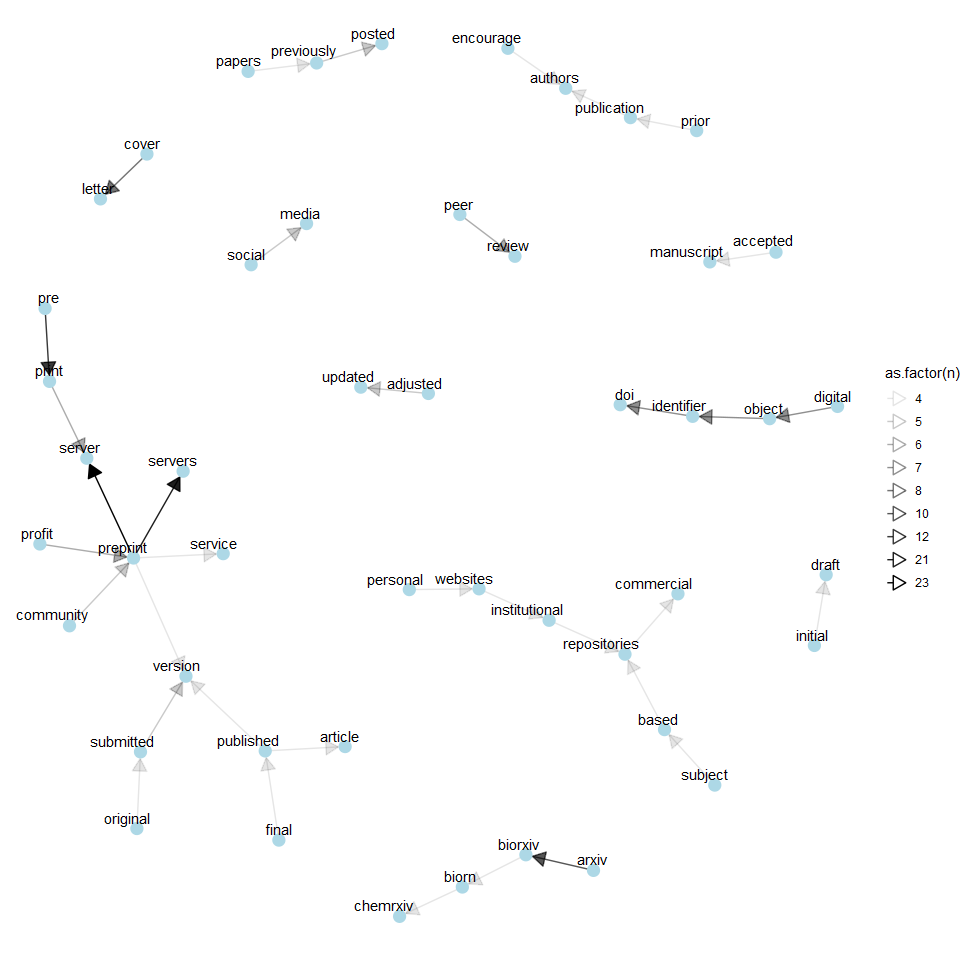<!-- -->


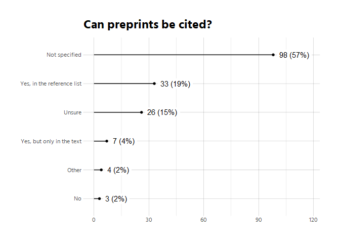<!-- -->

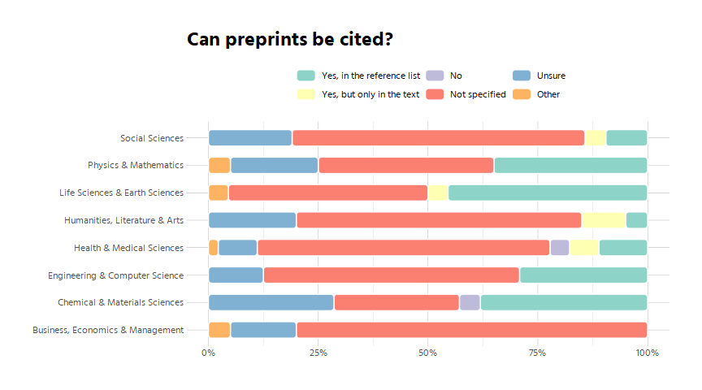<!-- -->


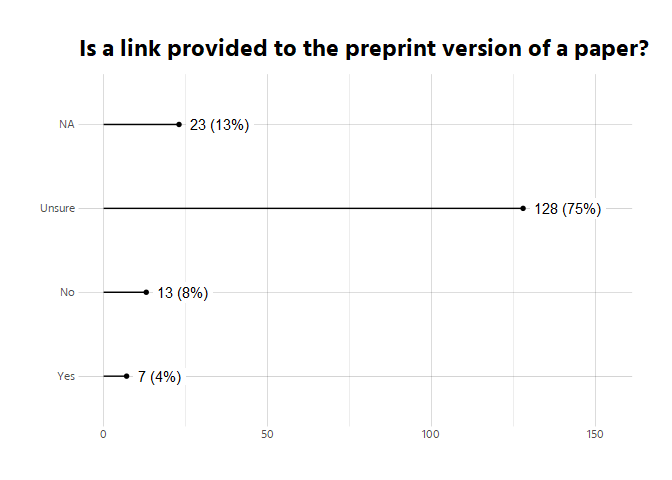<!-- -->


# Cross tabulations
Results so far have revealed that in many cases policies are unclear. But in
which ways are policies related to each other? Do journals that allow co-review
also allow preprints? Is there a gradient between journals that are pioneers in
regard to open science, and others that lag behind? Or are there certain groups
of journals, open in one area, reluctant in the second and maybe unclear in the
third?

To answer these question, we employ Multiple Correspondence Analysis (MCA). 
The technique allows us to explore the different policies jointly
(Greenacre & Blasius 2006: 27) and thus paint
a landscape of open science practices among journals.

To facilitate interpration of the figures, variables had to be recoded. 
Categories with low counts were merged. Where feasible, we focused on whether 
certain  policies were clear or not, thus omitting the subtle differences within
the policies (for example whether journals allowed citations of preprints was 
simplified for whether the policy was clear (references allowed in text, 
reference list or not allowed) versus unclear (unsure about policy, no policy 
and other)). 

It should be noted that the procedure is strictly exploratory. We are exploring,
not testing any hypothesis.


<!-- Results have until now been examined spearated from each other. To bring them  -->
<!-- all together, we will employ Correspondence Analysis as a means of visualising -->
<!-- and investigating adjecent sets of tables.  -->

<!-- Different variables could serve as dependent variables: disciplinary area is -->
<!-- the first contender. But this could have an overly strong influence. We could -->
<!-- thus also look at peer review type, and add discipline only as a supplementary  -->
<!-- variable. -->

<!-- Or we could do multiple correspondence analysis... -->

<!-- The question we have is: are there certain journals that have unclear policies -->
<!-- in general, or not. Thus: are there pioneers that are open to new concepts and -->
<!-- clear in their policies and then the others that lag behind. -->

<!-- From Greenacre & Blasius 2006: 27, we should conclude that MCA is the preferred -->
<!-- method for this question, because it allows us to investigate the relationship -->
<!-- between different aspects of open science. CA would only allow investigation of -->
<!-- these aspects relative to the disciplines, but not relative to one another. -->


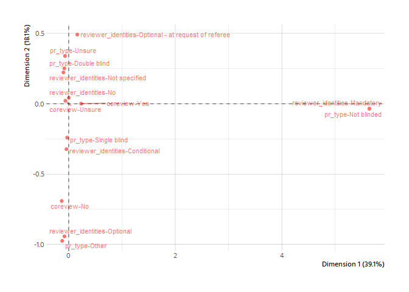<!-- -->


```
## 
## Principal inertias (eigenvalues):
## 
##  dim    value      %   cum%   scree plot               
##  1      0.084830  48.1  48.1  ****************         
##  2      0.018979  10.8  58.9  ****                     
##  3      0.017009   9.6  68.5  ***                      
##  4      0.006125   3.5  72.0  *                        
##  5      0.003927   2.2  74.2  *                        
##  6      0.001318   0.7  75.0                           
##  7      5.4e-050   0.0  75.0                           
##         -------- -----                                 
##  Total: 0.176313                                       
## 
## 
## Columns:
##                                                              name   mass  qlt
## 1  |                           pr_type_clean:pr_type-Double blind |   54  463
## 2  |                                  pr_type_clean:pr_type-Other |   21  758
## 3  |                           pr_type_clean:pr_type-Single blind |   60  524
## 4  |                                 pr_type_clean:pr_type-Unsure |   64  611
## 5  |                                   coreview_email:coreview-No |    5  167
## 6  |                               coreview_email:coreview-Unsure |  153  502
## 7  |                                  coreview_email:coreview-Yes |   43  443
## 8  |   opr_indenties_author_clean:reviewer_identities-Conditional |    7  248
## 9  |            opr_indenties_author_clean:reviewer_identities-No |   37  347
## 10 | opr_indenties_author_clean:reviewer_identities-Not specified |  118  767
## 11 |      opr_indenties_author_clean:reviewer_identities-Optional |   38  800
## 12 |            preprint_version_clean:preprint_version-No policy |   45  213
## 13 |                 preprint_version_clean:preprint_version-None |   11  260
## 14 |                preprint_version_clean:preprint_version-Other |    6  169
## 15 |               preprint_version_clean:preprint_version-Unsure |   28  526
## 16 |                  preprint_version_clean:preprint_version-Yes |  110  841
## 17 |                 preprint_citation_clean:preprint_citation-No |    4   89
## 18 |      preprint_citation_clean:preprint_citation-Not specified |  115  689
## 19 |              preprint_citation_clean:preprint_citation-Other |    5  385
## 20 |             preprint_citation_clean:preprint_citation-Unsure |   30  349
## 21 |                preprint_citation_clean:preprint_citation-Yes |   47  857
##     inr    k=1 cor ctr    k=2 cor ctr  
## 1    46 | -269 459  47 |  -26   4   2 |
## 2    75 |  967 709 235 |  255  49  73 |
## 3    44 |   93  67   6 | -242 457 187 |
## 4    41 | -181 332  25 |  166 279  92 |
## 5    53 |  194  53   2 | -286 114  20 |
## 6    15 |  -50 132   5 |   84 370  57 |
## 7    50 |  158 114  13 | -269 329 162 |
## 8    59 |  -98   8   1 | -552 240 114 |
## 9    49 |   28   4   0 | -260 343 131 |
## 10   31 | -228 632  72 |  105 135  69 |
## 11   66 |  704 799 221 |   27   1   1 |
## 12   44 | -118 165   7 |  -63  47  10 |
## 13   53 | -332 260  14 |  -13   0   0 |
## 14   54 | -322 139   7 |  150  30   7 |
## 15   49 | -308 526  32 |   10   1   0 |
## 16   27 |  177 834  41 |   17   7   2 |
## 17   55 | -228  39   2 |  261  51  13 |
## 18   27 | -176 688  42 |   -5   1   0 |
## 19   52 | -296 201   5 |  283 185  20 |
## 20   50 | -216 242  16 | -144 107  32 |
## 21   60 |  610 850 207 |   55   7   8 |
```

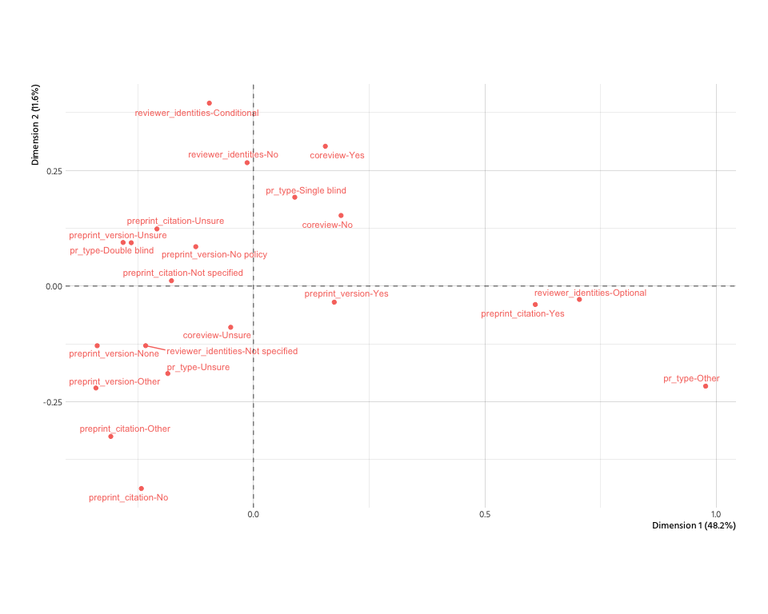<!-- -->


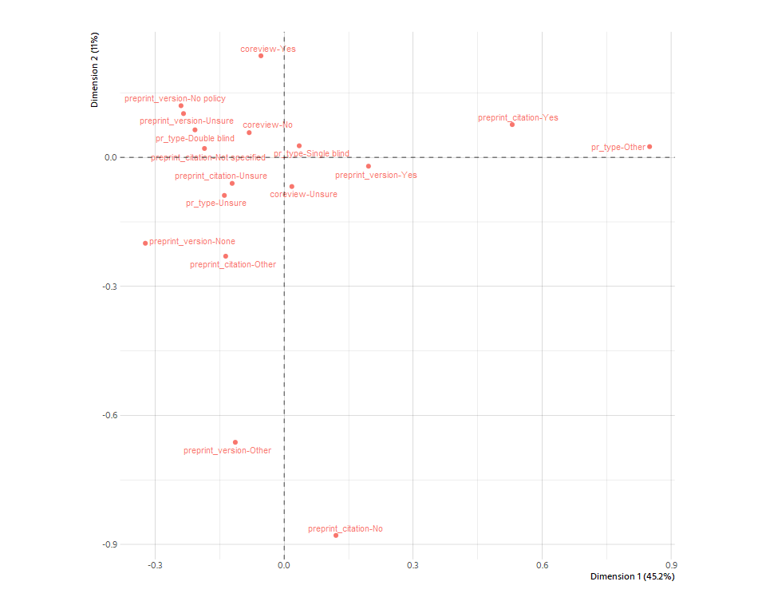<!-- -->


```
## 
## Principal inertias (eigenvalues):
## 
##  dim    value      %   cum%   scree plot               
##  1      0.065420  47.6  47.6  *****************        
##  2      0.014348  10.4  58.0  ****                     
##  3      0.008288   6.0  64.1  **                       
##  4      0.006491   4.7  68.8  **                       
##  5      0.003326   2.4  71.2  *                        
##  6      0.000656   0.5  71.7                           
##         -------- -----                                 
##  Total: 0.137454                                       
## 
## 
## Columns:
##                                                         name   mass  qlt  inr  
## 1  |                      pr_type_clean:pr_type-Double blind |   62  412   59 |
## 2  |                             pr_type_clean:pr_type-Other |   29  716   84 |
## 3  |                      pr_type_clean:pr_type-Single blind |   81   71   51 |
## 4  |                            pr_type_clean:pr_type-Unsure |   79  513   52 |
## 5  |                              coreview_email:coreview-No |    5   33   69 |
## 6  |                          coreview_email:coreview-Unsure |  190  439   18 |
## 7  |                             coreview_email:coreview-Yes |   55  444   60 |
## 8  |       preprint_version_clean:preprint_version-No policy |   51  715   59 |
## 9  |            preprint_version_clean:preprint_version-None |   16  471   70 |
## 10 |           preprint_version_clean:preprint_version-Other |    7  464   72 |
## 11 |          preprint_version_clean:preprint_version-Unsure |   33  582   63 |
## 12 |             preprint_version_clean:preprint_version-Yes |  144  903   34 |
## 13 |            preprint_citation_clean:preprint_citation-No |    4  403   73 |
## 14 | preprint_citation_clean:preprint_citation-Not specified |  144  758   35 |
## 15 |         preprint_citation_clean:preprint_citation-Other |    5  173   69 |
## 16 |        preprint_citation_clean:preprint_citation-Unsure |   35  269   61 |
## 17 |           preprint_citation_clean:preprint_citation-Yes |   62  750   72 |
## 18 |                (*)area:Business, Economics & Management | <NA>  666 <NA> |
## 19 |                   (*)area:Chemical & Materials Sciences | <NA>  680 <NA> |
## 20 |                  (*)area:Engineering & Computer Science | <NA>  597 <NA> |
## 21 |                       (*)area:Health & Medical Sciences | <NA>   13 <NA> |
## 22 |                   (*)area:Humanities, Literature & Arts | <NA>  162 <NA> |
## 23 |                  (*)area:Life Sciences & Earth Sciences | <NA>  765 <NA> |
## 24 |                           (*)area:Physics & Mathematics | <NA>  273 <NA> |
## 25 |                                 (*)area:Social Sciences | <NA>  246 <NA> |
##     k=1 cor  ctr    k=2 cor  ctr  
## 1   234 378   51 |  -70  34   21 |
## 2  -853 716  320 |   17   0    1 |
## 3   -33  16    1 |  -61  55   21 |
## 4   164 349   32 |  112 164   69 |
## 5   114  21    1 |  -87  12    3 |
## 6   -17  23    1 |   74 416   72 |
## 7    50  17    2 | -246 427  233 |
## 8   269 616   57 | -108  99   42 |
## 9   370 317   33 |  257 154   73 |
## 10  146  22    2 |  650 441  193 |
## 11  256 457   33 | -133 124   41 |
## 12 -201 900   89 |   11   3    1 |
## 13  -91   5    0 |  819 398  184 |
## 14  198 750   87 |  -20   7    4 |
## 15  167  55    2 |  244 118   22 |
## 16  127 226    9 |   55  43    8 |
## 17 -546 741  280 |  -59   9   15 |
## 18  476 609 <NA> |  145  56 <NA> |
## 19 -253 234 <NA> |  350 446 <NA> |
## 20 -128 240 <NA> |  156 357 <NA> |
## 21   34  10 <NA> |  -18   3 <NA> |
## 22  251 126 <NA> | -135  36 <NA> |
## 23 -510 679 <NA> | -181  85 <NA> |
## 24 -118 173 <NA> |  -90 100 <NA> |
## 25  285 151 <NA> | -226  95 <NA> |
```

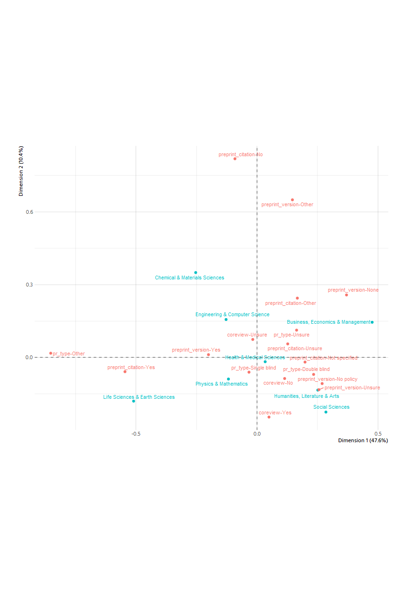<!-- -->

This looks intelligble, but lets try one more time with this crude variable


```
## 
## Principal inertias (eigenvalues):
## 
##  dim    value      %   cum%   scree plot               
##  1      0.094812  50.8  50.8  *****************        
##  2      0.020753  11.1  61.9  ****                     
##  3      0.014912   8.0  69.8  ***                      
##  4      0.006140   3.3  73.1  *                        
##  5      0.003838   2.1  75.2  *                        
##  6      0.001308   0.7  75.9                           
##  7      7e-05000   0.0  75.9                           
##         -------- -----                                 
##  Total: 0.186803                                       
## 
## 
## Columns:
##                                                              name   mass  qlt
## 1  |                           pr_type_clean:pr_type-Double blind |   49  451
## 2  |                                  pr_type_clean:pr_type-Other |   23  770
## 3  |                           pr_type_clean:pr_type-Single blind |   65  482
## 4  |                                 pr_type_clean:pr_type-Unsure |   63  659
## 5  |                                   coreview_email:coreview-No |    4   71
## 6  |                               coreview_email:coreview-Unsure |  152  524
## 7  |                                  coreview_email:coreview-Yes |   44  501
## 8  |   opr_indenties_author_clean:reviewer_identities-Conditional |    9  243
## 9  |            opr_indenties_author_clean:reviewer_identities-No |   34  424
## 10 | opr_indenties_author_clean:reviewer_identities-Not specified |  116  785
## 11 |      opr_indenties_author_clean:reviewer_identities-Optional |   41  819
## 12 |            preprint_version_clean:preprint_version-No policy |   41  297
## 13 |                 preprint_version_clean:preprint_version-None |   13  501
## 14 |                preprint_version_clean:preprint_version-Other |    5  161
## 15 |               preprint_version_clean:preprint_version-Unsure |   26  530
## 16 |                  preprint_version_clean:preprint_version-Yes |  115  889
## 17 |                 preprint_citation_clean:preprint_citation-No |    3   93
## 18 |      preprint_citation_clean:preprint_citation-Not specified |  115  751
## 19 |              preprint_citation_clean:preprint_citation-Other |    4  364
## 20 |             preprint_citation_clean:preprint_citation-Unsure |   28  337
## 21 |                preprint_citation_clean:preprint_citation-Yes |   49  862
## 22 |                     (*)area:Business, Economics & Management | <NA>  790
## 23 |                        (*)area:Chemical & Materials Sciences | <NA>   88
## 24 |                       (*)area:Engineering & Computer Science | <NA>  210
## 25 |                            (*)area:Health & Medical Sciences | <NA>   61
## 26 |                        (*)area:Humanities, Literature & Arts | <NA>  199
## 27 |                       (*)area:Life Sciences & Earth Sciences | <NA>  848
## 28 |                                (*)area:Physics & Mathematics | <NA>  448
## 29 |                                      (*)area:Social Sciences | <NA>  261
##     inr    k=1 cor  ctr    k=2 cor  ctr  
## 1    48 | -296 442   45 |  -43   9    4 |
## 2    76 |  988 727  237 |  240  43   64 |
## 3    42 |   78  50    4 | -229 432  164 |
## 4    42 | -211 378   30 |  182 281  100 |
## 5    52 |  142  32    1 | -156  39    5 |
## 6    15 |  -41  90    3 |   90 434   59 |
## 7    49 |  127  79    8 | -295 422  184 |
## 8    58 | -103  11    1 | -481 233  105 |
## 9    49 |   -3   0    0 | -300 424  146 |
## 10   32 | -240 640   71 |  114 145   73 |
## 11   66 |  710 817  217 |   32   2    2 |
## 12   45 | -167 263   12 |  -59  33    7 |
## 13   53 | -403 389   22 |  216 112   28 |
## 14   54 | -339 133    6 |  153  27    6 |
## 15   49 | -321 517   28 |  -51  13    3 |
## 16   26 |  192 889   45 |    2   0    0 |
## 17   54 | -231  37    2 |  285  56   12 |
## 18   27 | -194 748   46 |  -13   3    1 |
## 19   52 | -314 212    4 |  265 151   14 |
## 20   49 | -228 274   16 | -110  63   16 |
## 21   61 |  626 857  203 |   52   6    6 |
## 22 <NA> | -509 693 <NA> |  190  96 <NA> |
## 23 <NA> |  184  85 <NA> |   32   3 <NA> |
## 24 <NA> |   42  30 <NA> |  102 180 <NA> |
## 25 <NA> |   49  25 <NA> |  -59  36 <NA> |
## 26 <NA> | -304 197 <NA> |   34   2 <NA> |
## 27 <NA> |  642 848 <NA> |  -14   0 <NA> |
## 28 <NA> |  140 163 <NA> | -185 284 <NA> |
## 29 <NA> | -365 256 <NA> |  -50   5 <NA> |
```

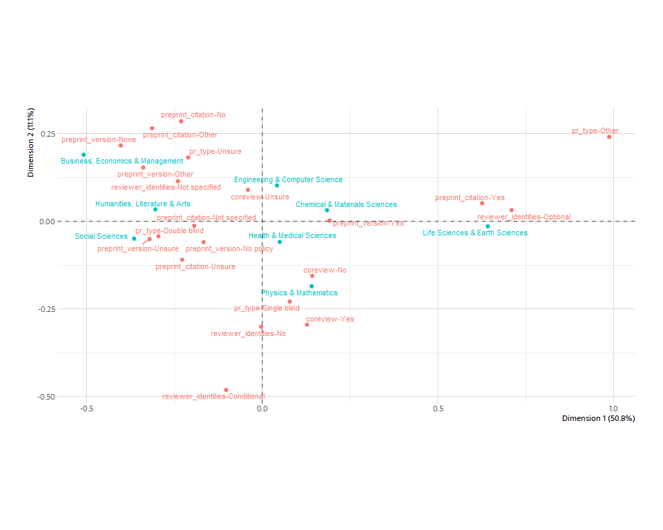<!-- -->


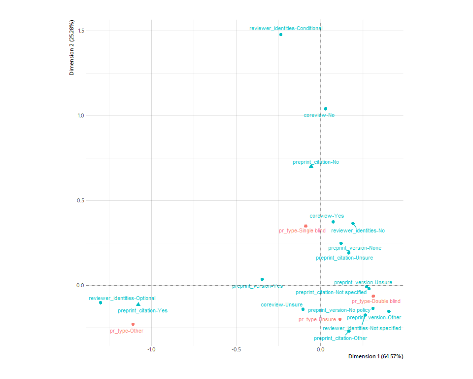<!-- -->


```
## Warning in stats::chisq.test(x, y, ...): Chi-squared approximation may be
## incorrect
```

```
## 
## 	Pearson's Chi-squared test
## 
## data:  .
## X-squared = 259.28, df = 105, p-value = 4.713e-15
```

```
## Warning in stats::chisq.test(tab, correct = FALSE): Chi-squared approximation
## may be incorrect
```

```
## [1] 0.2201843
```

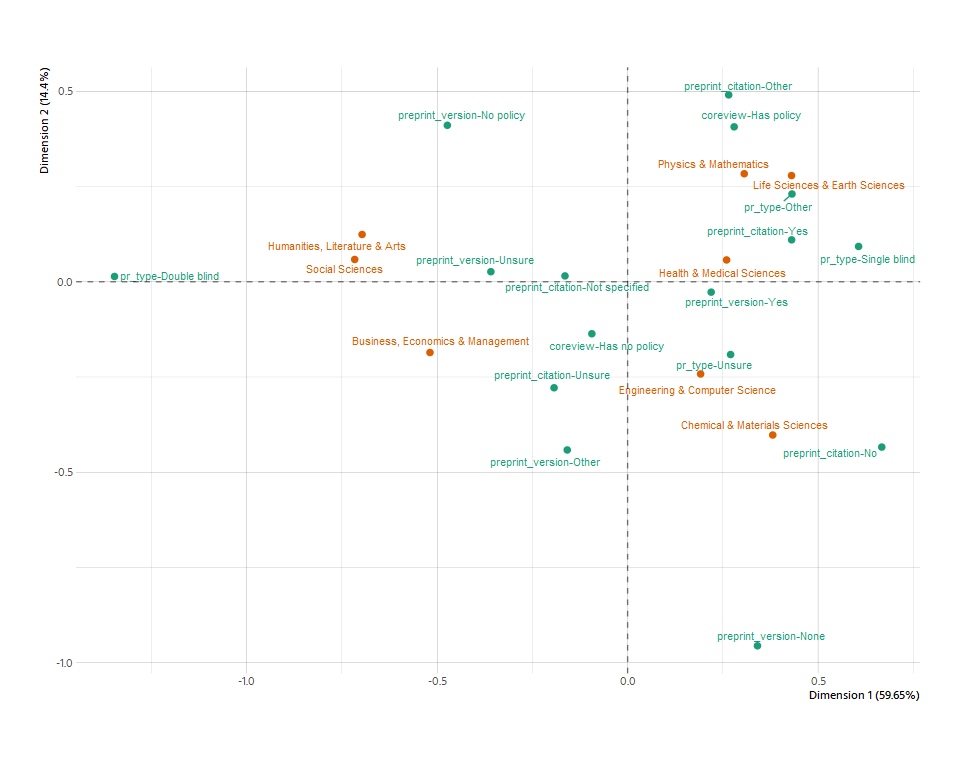<!-- -->

First axis is distinction between SSH and sciences. Second axis is more 
difficult in terms of what it means. It also has not that much inertia, thus 
being not very influential


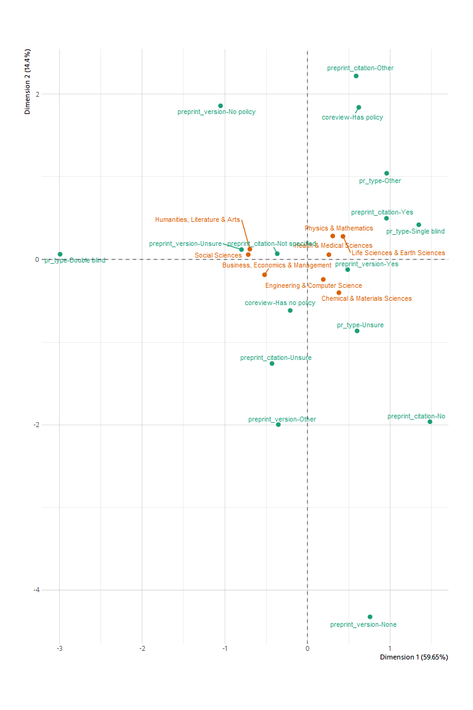<!-- -->


```
## 
## Principal inertias (eigenvalues):
## 
##  dim    value      %   cum%   scree plot               
##  1      0.202431  59.6  59.6  ***************          
##  2      0.048870  14.4  74.0  ****                     
##  3      0.035233  10.4  84.4  ***                      
##  4      0.024852   7.3  91.8  **                       
##  5      0.016925   5.0  96.7  *                        
##  6      0.008446   2.5  99.2  *                        
##  7      0.002610   0.8 100.0                           
##         -------- -----                                 
##  Total: 0.339368 100.0                                 
## 
## 
## Rows:
##               name   mass  qlt  inr     k=1 cor ctr    k=2 cor ctr  
## 1  |       crvwHsn |  187  877   17 |   -94 282   8 | -137 596  71 |
## 2  |       crvwHsp |   63  877   51 |   280 282  24 |  407 596 213 |
## 3  | prprnt_vrsnNp |   51  606   98 |  -473 345  56 |  411 260 176 |
## 4  | prprnt_vrsnNn |   16  980   49 |   341 111   9 | -956 869 294 |
## 5  |     prprnt_vO |    7  272   16 |  -158  31   1 | -442 241  26 |
## 6  |     prprnt_vU |   33  283   44 |  -359 282  21 |   26   2   0 |
## 7  |     prprnt_vY |  144  682   30 |   219 671  34 |  -27  10   2 |
## 8  | preprnt_cttnN |    4  319   23 |   667 224   9 | -434  95  15 |
## 9  | prprnt_cttnNt |  144  391   30 |  -164 388  19 |   15   3   1 |
## 10 |     prprnt_cO |    5  307   16 |   265  69   2 |  491 237  26 |
## 11 |     prprnt_cU |   35  339   35 |  -193 110   7 | -278 229  56 |
## 12 |     prprnt_cY |   62  595   60 |   431 558  56 |  110  36  15 |
## 13 |          pr_D |   62  974  338 | -1347 974 551 |   14   0   0 |
## 14 |         pr_tO |   29  461   44 |   432 358  26 |  230 102  31 |
## 15 |          pr_S |   81  877  103 |   606 857 147 |   93  20  14 |
## 16 |         pr_tU |   79  539   47 |   270 359  28 | -191 179  59 |
## 
## Columns:
##     name   mass  qlt  inr    k=1 cor ctr    k=2 cor ctr  
## 1 | BsEM |  105  760  123 | -519 673 139 | -186  86  74 |
## 2 | ChMS |  110  825  121 |  381 390  79 | -402 435 364 |
## 3 | EnCS |  126  728   49 |  192 280  23 | -242 447 151 |
## 4 | HlMS |  225  486   97 |  260 464  75 |   57  23  15 |
## 5 | HmLA |  105  818  189 | -697 792 251 |  124  25  33 |
## 6 | LSES |  115  700  128 |  430 493 105 |  279 207 183 |
## 7 | PhyM |  105  628   86 |  306 338  48 |  284 290 172 |
## 8 | SclS |  110  802  209 | -716 797 279 |   58   5   8 |
```

```
## 
##  Principal inertias (eigenvalues):
##            1        2       3        4        5        6        7      
## Value      0.202431 0.04887 0.035233 0.024852 0.016925 0.008446 0.00261
## Percentage 59.65%   14.4%   10.38%   7.32%    4.99%    2.49%    0.77%  
## 
## 
##  Rows:
##         coreview-Has no policy coreview-Has policy preprint_version-No policy
## Mass                  0.187173            0.062827                   0.051047
## ChiDist               0.176868            0.526919                   0.805284
## Inertia               0.005855            0.017444                   0.033103
## Dim. 1               -0.208662            0.621639                  -1.051879
## Dim. 2               -0.617497            1.839628                   1.858271
##         preprint_version-None preprint_version-Other preprint_version-Unsure
## Mass                 0.015707               0.006545                0.032723
## ChiDist              1.025120               0.899974                0.676312
## Inertia              0.016506               0.005301                0.014967
## Dim. 1               0.757799              -0.352191               -0.797899
## Dim. 2              -4.323368              -1.997743                0.119226
##         preprint_version-Yes preprint_citation-No
## Mass                0.143979             0.003927
## ChiDist             0.267798             1.408809
## Inertia             0.010326             0.007793
## Dim. 1              0.487619             1.483073
## Dim. 2             -0.123492            -1.963233
##         preprint_citation-Not specified preprint_citation-Other
## Mass                           0.143979                0.005236
## ChiDist                        0.264054                1.006966
## Inertia                        0.010039                0.005309
## Dim. 1                        -0.365443                0.589690
## Dim. 2                         0.069211                2.219163
##         preprint_citation-Unsure preprint_citation-Yes pr_type-Double blind
## Mass                    0.035340              0.061518             0.061518
## ChiDist                 0.582205              0.576274             1.364655
## Inertia                 0.011979              0.020430             0.114565
## Dim. 1                 -0.429116              0.956954            -2.993924
## Dim. 2                 -1.259100              0.497778             0.062737
##         pr_type-Other pr_type-Single blind pr_type-Unsure
## Mass         0.028796             0.081152       0.078534
## ChiDist      0.720790             0.654872       0.451213
## Inertia      0.014961             0.034803       0.015989
## Dim. 1       0.959127             1.347637       0.601002
## Dim. 2       1.042317             0.419260      -0.864563
## 
## 
##  Columns:
##         Business, Economics & Management Chemical & Materials Sciences
## Mass                            0.104712                      0.109948
## ChiDist                         0.632291                      0.609887
## Inertia                         0.041863                      0.040896
## Dim. 1                         -1.153188                      0.846897
## Dim. 2                         -0.840234                     -1.819903
##         Engineering & Computer Science Health & Medical Sciences
## Mass                          0.125654                  0.225131
## ChiDist                       0.361956                  0.381467
## Inertia                       0.016462                  0.032760
## Dim. 1                        0.425946                  0.577454
## Dim. 2                       -1.095257                  0.258944
##         Humanities, Literature & Arts Life Sciences & Earth Sciences
## Mass                         0.104712                       0.115183
## ChiDist                      0.783012                       0.612972
## Inertia                      0.064200                       0.043278
## Dim. 1                      -1.549271                       0.956480
## Dim. 2                       0.561214                       1.260950
##         Physics & Mathematics Social Sciences
## Mass                 0.104712        0.109948
## ChiDist              0.526766        0.802754
## Inertia              0.029056        0.070852
## Dim. 1               0.680514       -1.592465
## Dim. 2               1.282670        0.264554
```

Axes are mainly determined by peer review policy. Maybe remove this variable to
bring out mor subtle and potentialy more meaningful answers regarding the key 
topics (that SSH have double blind and Sciences have single blind seems to be 
well established)

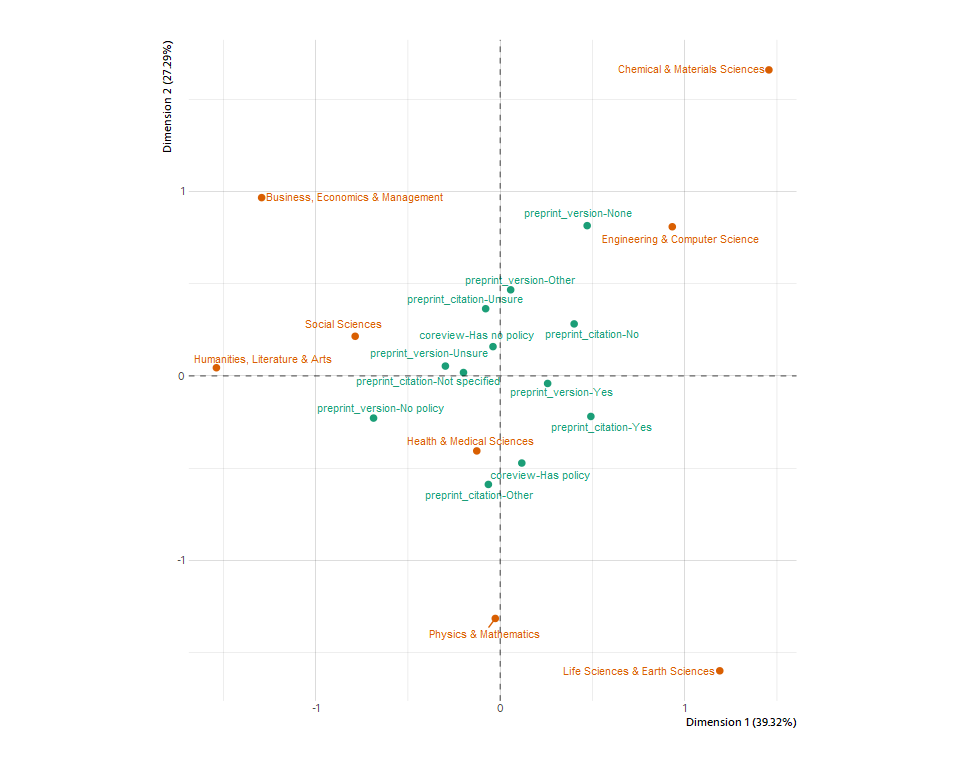<!-- -->


```
## 
## Principal inertias (eigenvalues):
## 
##  dim    value      %   cum%   scree plot               
##  1      0.083386  39.3  39.3  **********               
##  2      0.057864  27.3  66.6  *******                  
##  3      0.033091  15.6  82.2  ****                     
##  4      0.015940   7.5  89.7  **                       
##  5      0.011894   5.6  95.3  *                        
##  6      0.007877   3.7  99.0  *                        
##  7      0.002017   1.0 100.0                           
##         -------- -----                                 
##  Total: 0.212068 100.0                                 
## 
## 
## Rows:
##               name   mass  qlt  inr    k=1 cor ctr    k=2 cor ctr  
## 1  |       crvwHsn |  250  853   37 |  -39  49   5 |  159 804 108 |
## 2  |       crvwHsp |   84  853  110 |  117  49  14 | -472 804 323 |
## 3  | prprnt_vrsnNp |   68  807  208 | -687 727 385 | -229  81  61 |
## 4  | prprnt_vrsnNn |   21  842  104 |  471 211  56 |  814 631 240 |
## 5  |     prprnt_vO |    9  273   33 |   57   4   0 |  467 269  33 |
## 6  |     prprnt_vU |   44  199   94 | -297 193  46 |   53   6   2 |
## 7  |     prprnt_vY |  192  944   65 |  257 921 152 |  -41  23   6 |
## 8  | preprnt_cttnN |    5  121   49 |  401  81  10 |  282  40   7 |
## 9  | prprnt_cttnNt |  192  573   63 | -199 569  91 |   18   5   1 |
## 10 |     prprnt_cO |    7  345   33 |  -64   4   0 | -588 341  42 |
## 11 |     prprnt_cU |   47  410   75 |  -79  18   4 |  364 391 108 |
## 12 |     prprnt_cY |   82  872  128 |  491 727 237 | -220 146  69 |
## 
## Columns:
##     name   mass  qlt  inr    k=1 cor ctr    k=2 cor ctr  
## 1 | BsEM |  105  800  119 | -373 577 175 |  232 223  98 |
## 2 | ChMS |  110  876  199 |  420 461 233 |  399 415 302 |
## 3 | EnCS |  126  770   85 |  269 506 109 |  194 264  82 |
## 4 | HlMS |  225  153   76 |  -37  19   4 |  -98 134  37 |
## 5 | HmLA |  105  588  166 | -444 587 248 |   11   0   0 |
## 6 | LSES |  115  915  158 |  344 406 163 | -384 509 294 |
## 7 | PhyM |  105  478  103 |   -8   0   0 | -316 478 181 |
## 8 | SclS |  110  299   94 | -227 284  68 |   52  15   5 |
```

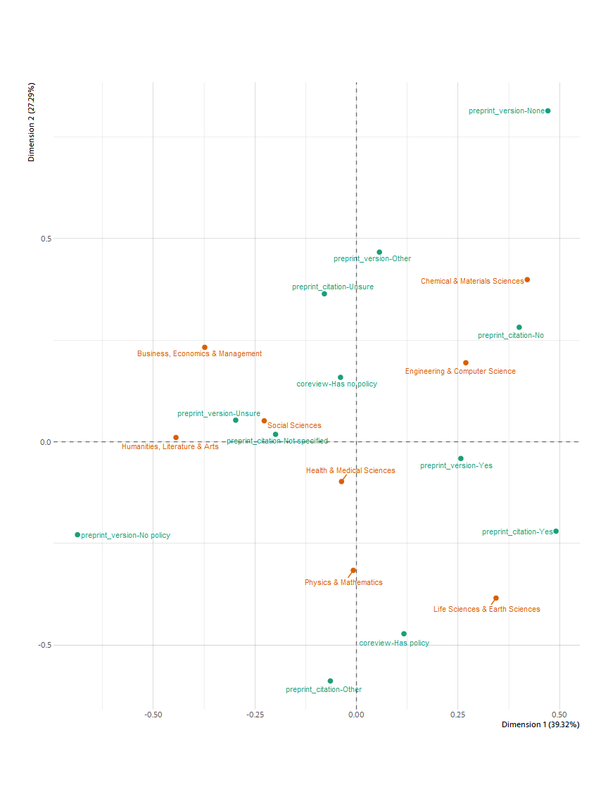<!-- -->

There is not much variation left to explain here, somehow.


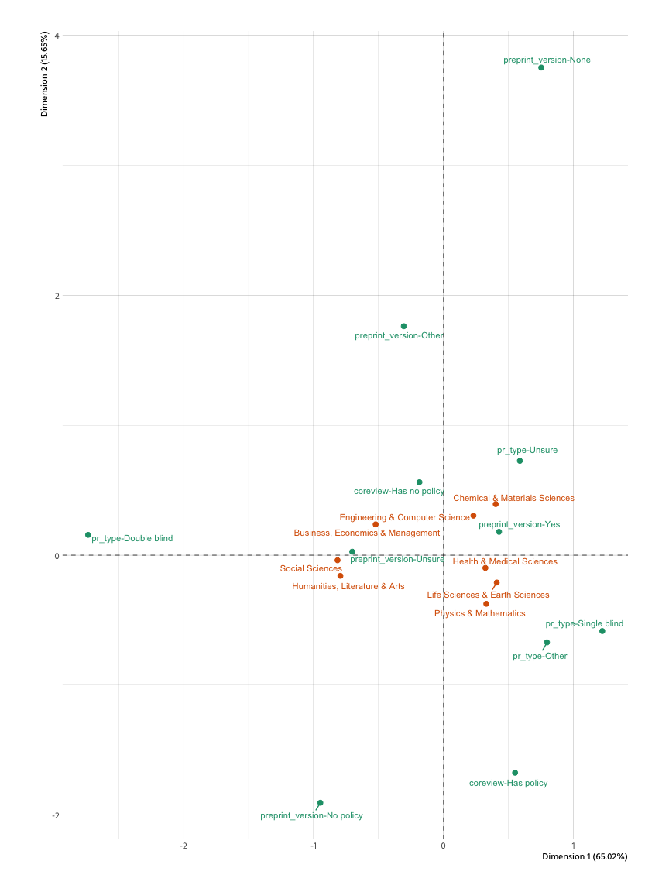<!-- -->


```
## 
## Principal inertias (eigenvalues):
## 
##  dim    value      %   cum%   scree plot               
##  1      0.246042  65.0  65.0  ****************         
##  2      0.059231  15.7  80.7  ****                     
##  3      0.034367   9.1  89.8  **                       
##  4      0.024482   6.5  96.2  **                       
##  5      0.009633   2.5  98.8  *                        
##  6      0.003869   1.0  99.8                           
##  7      8e-04000   0.2 100.0                           
##         -------- -----                                 
##  Total: 0.378424 100.0                                 
## 
## 
## Rows:
##               name   mass  qlt  inr     k=1 cor ctr    k=2 cor ctr  
## 1  |          pr_D |   82  989  404 | -1357 988 614 |   38   1   2 |
## 2  |         pr_tO |   38  352   53 |   395 300  24 | -163  51  17 |
## 3  |          pr_S |  108  904  123 |   606 857 162 | -142  47  37 |
## 4  |         pr_tU |  105  571   56 |   292 417  36 |  177 153  55 |
## 5  |       crvwHsn |  250  867   21 |   -92 269   9 |  137 598  79 |
## 6  |       crvwHsp |   84  867   61 |   273 269  25 | -407 598 235 |
## 7  | prprnt_vrsnNp |   68  672  117 |  -470 341  61 | -464 331 247 |
## 8  | prprnt_vrsnNn |   21  926   58 |   373 132  12 |  913 794 295 |
## 9  |         prp_O |    9  255   19 |  -152  28   1 |  429 227  27 |
## 10 |         prp_U |   44  266   53 |  -348 265  22 |    7   0   0 |
## 11 |          pr_Y |  192  654   36 |   212 627  35 |   44  27   6 |
## 
## Columns:
##     name   mass  qlt  inr    k=1 cor ctr    k=2 cor ctr  
## 1 | BsEM |  105  816  112 | -522 676 116 |  237 139  99 |
## 2 | ChMS |  110  917  100 |  402 468  72 |  393 449 287 |
## 3 | EnCS |  126  916   53 |  230 334  27 |  304 582 196 |
## 4 | HlMS |  225  750   90 |  322 687  95 |  -98  63  36 |
## 5 | HmLA |  105  838  216 | -793 805 268 | -159  32  45 |
## 6 | LSES |  115  618  104 |  410 489  79 | -210 129  86 |
## 7 | PhyM |  105  799   86 |  329 349  46 | -374 450 247 |
## 8 | SclS |  110  810  239 | -815 808 297 |  -39   2   3 |
```


```
## Warning in stats::chisq.test(x, y, ...): Chi-squared approximation may be
## incorrect
```

```
## 
## 	Pearson's Chi-squared test
## 
## data:  .
## X-squared = 155.56, df = 35, p-value < 2.2e-16
```

