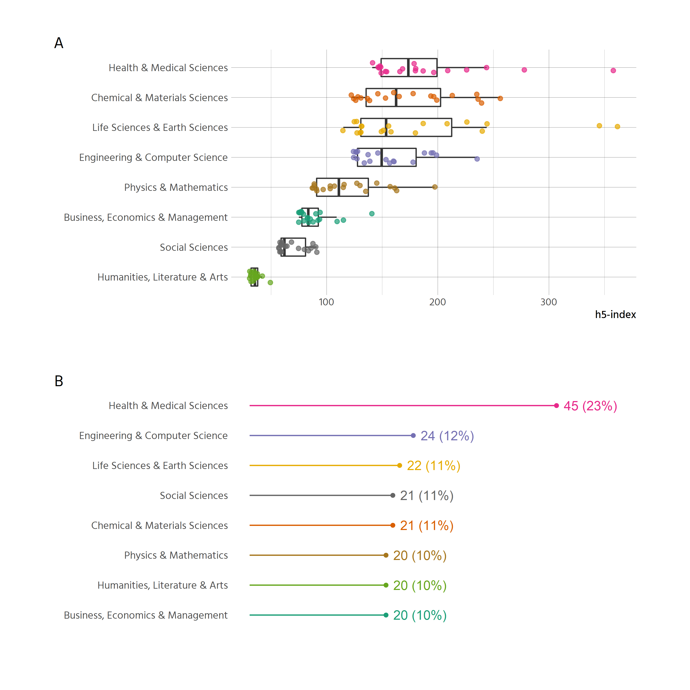
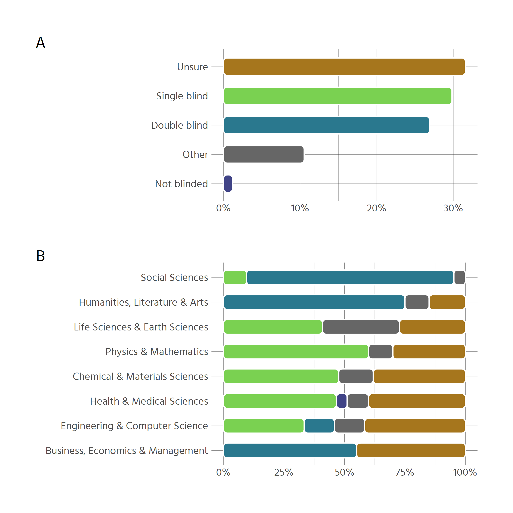
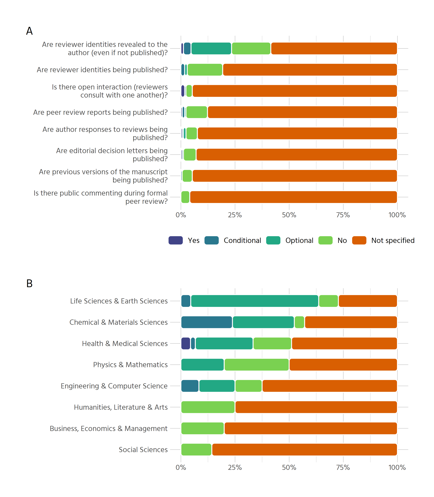
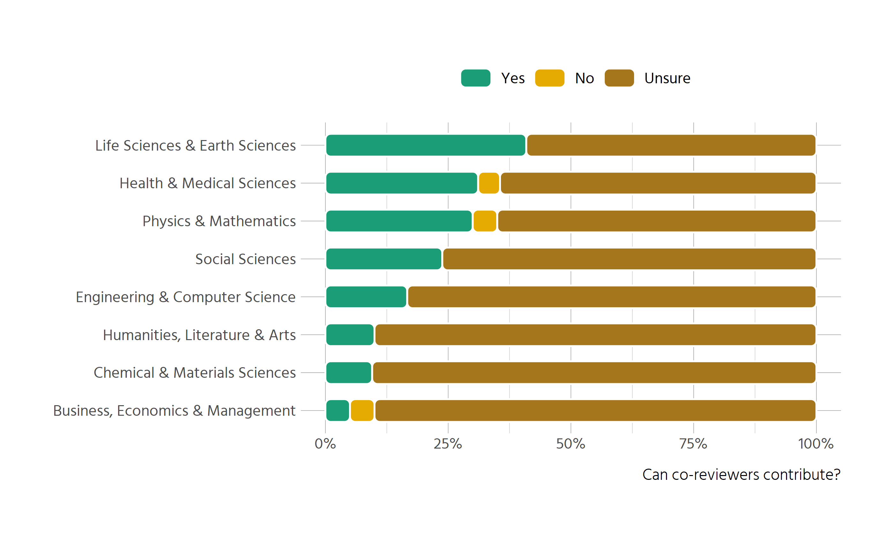
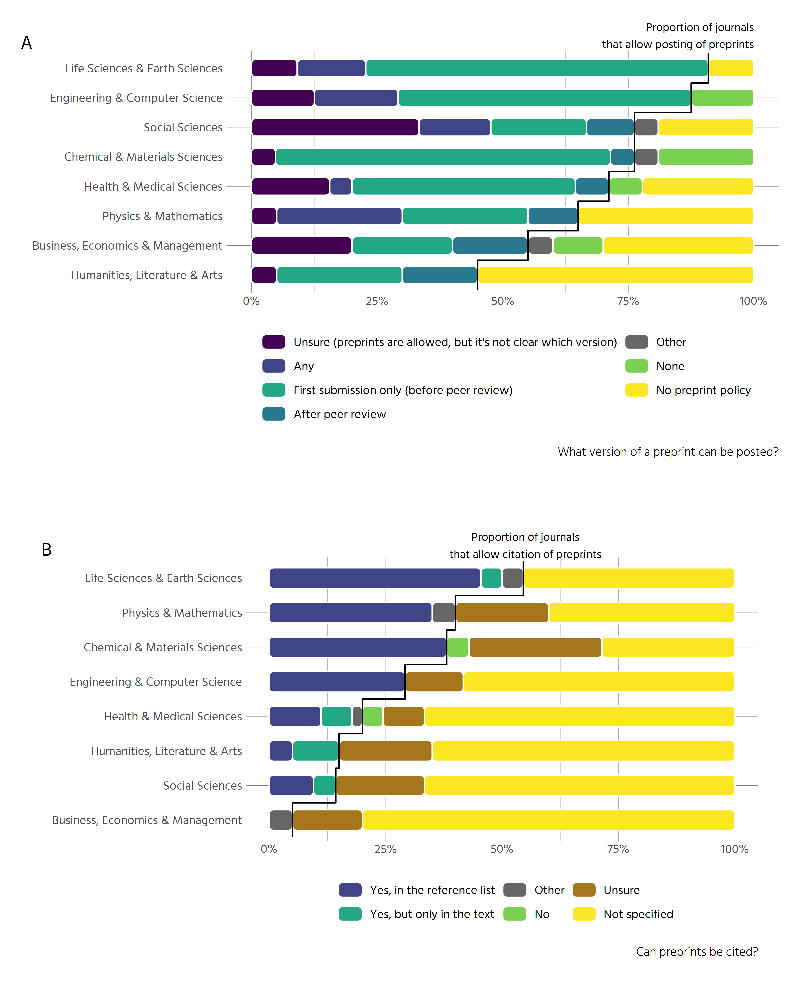
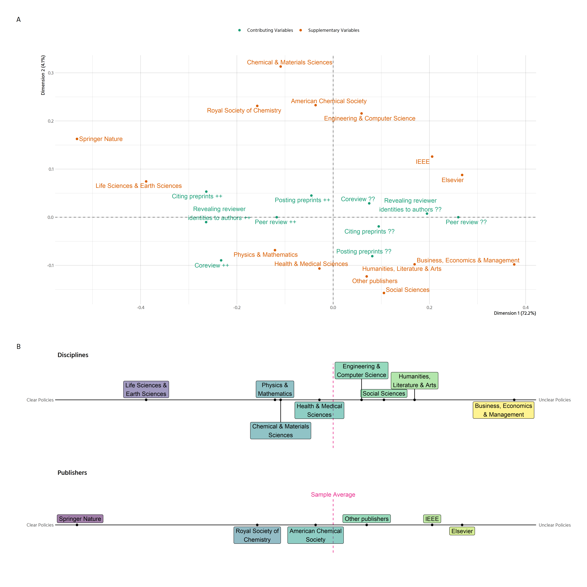
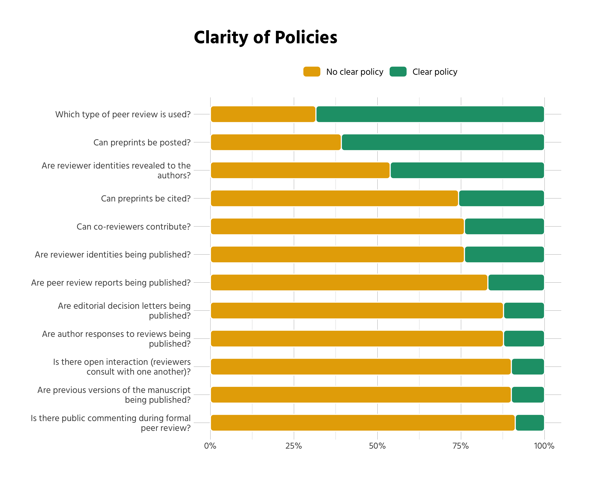

# Sample characteristics
The approach taken to create the sample of journals led to a few journals 
having no data on disciplinary area: some journals like "Gut" were within the 
top 100 journals, but not within any of the sub-categories. This is because the
h-index varies greatly between sub-categories. Figure
\@ref(fig:h-indices)A
shows the top-20 journals of each discipline.

The missing categorisations were added in a second step, to facilitate analysis 
of all journals that distinguishes by discipline. To this end, we scraped all 
disciplines and sub-disciplines from Google Scholar and matched those to our data.
^[The code for collecting the data from Google Scholar can be found here:
ADD LINKS HERE TO DATA AND SCRIPT]

As stated, the criteria for inclusion into the Google Scholar rankings are opaque
and non-reproducible. For example it is possible for a journal to be included in
different disciplines, which makes a lot of sense
(for example "Physics & Mathematics" along with 
"Engineering & Computer Science"). It is however also possible for a journal to
be included in a sub-discipline, and not in the parent discipline, despite 
having a higher h-index than all journals listed in the parent discipline.^[As
of 2019-07-02, the "Journal of Cleaner Production" is listed in the social 
sciences under "sustainable development"
(https://scholar.google.at/citations?view_op=top_venues&hl=en&vq=soc_sustainabledevelopment). 
But it is not listed under the parent category 
(https://scholar.google.at/citations?view_op=top_venues&hl=en&vq=soc).]


The nature of our selection means that 
22 out of 171 journals are assigned to two
disciplines. The inclusion criteria further mean, that disciplines are not 
represented equally in the sample. Since many of the top 100 journals belong to 
the health and medical sciences, the sample is slightly skewed in that direction
(see figure \@ref(fig:h-indices)B).

<div class="figure">

<p class="caption">(\#fig:h-indices)Sample characteristics</p>
</div>

(A): The distribution of h5-indices across the top-20 journals of each 
discipline. (B) Number and proportion of journals sampled by discipline in total.


Regarding practices of open access, only 8 of 
171 journals are listed in the Directory of Open Access 
Journals (DOAJ) and can thus be considered fully open access. ^[Code and data 
for querying the DOAJ API and matching to our data can be found here FIXME]


# Peer Review


Information on what type of peer review is used by a journal is mixed 
(see figure \@ref(fig:peer-type-combined)A).
Overall, 54 out of 171 journals (31.6%)  do not provide clear 
information about their peer review process. The most common peer review 
practice is single blind per review (30%), followed by double blind
peer review (27%).
Some journals offer the option for authors to 
choose whether to use single or double blind peer review. These cases have been
coded as "Other" and amount to the majority of this category. 1% 
of journals ("The BMJ" and "The Cochrane Database of Systematic Reviews") do not 
anonymize papers or reviews during review process.


<div class="figure">

<p class="caption">(\#fig:peer-type-combined)Type of peer review employed by journals</p>
</div>

(A) Type of peer review used overall (n = 171)
(B) Type of peer review used by disciplines (n = 193)


However, there are major differences between disciplines (see figure 
\@ref(fig:peer-type-combined)B). In the social sciences, humanities, and business, double
blind peer review is generally the norm, while in the natural sciences it is
single
blind peer review. Business, economics & management displays the highest level
of unclear policies, with social science and humanities being very clear and the
other sciences somehwere in between. 


# Open Peer Review


Information on open peer review is similarly scarce (see fig. \@ref(fig:opr-combined)A). 
The survey included questions on common dimensions of open peer review, like
whether peer review reports, editorial decision letters or previous versions of
the manuscript are published, or whether there is public commenting during peer
review, and similar questions. All surveyed aspects of 
open peer review lack any kind of information in more than 50% of journals 
surveyed. 
Furthermore, three quarters of journals do not provide information on all except
one aspect. When there is information, in most cases it is 
dismissive of open peer review. No journal in our sample allows public 
commenting during formal peer review. Other forms of openness are similarly 
rare With the sole exception that some journals may reveal reviewer 
identities to the authors, all other aspects are not specified or not
available in more than 95% of journals.

<div class="figure">

<p class="caption">(\#fig:opr-combined)Aspects of open peer review</p>
</div>

(A) Aspects of open peer review across all journals in the sample (n = 171)
(B) Results on whether reviewer identitities are revealed to the authors, even if
they are not published. (n = 193)


Since the aspect of revealed reviewer identities is the only one that is
explicitly allowed by a substantive number of journals 
(23.4%), we examine it
separately for each discipline
(see fig. \@ref(fig:opr-combined)B). Whereas revealing reviewer
identities to the authors is absent from the social sciences, humanities and
business in the investigated subset of journals, it is not unusual in the
natural sciences, at least on an optional basis 
(for example in case the referee wants to sign their review). 


TODO: explain differences between Yes, Mandatory, Conditional, Optional. Tony to
check and explain.


# Co-Review 

Information on co-review policies is sparse. 
Only 87 out of 171 journals do have an
explicit co-review policy.

Splitting the results by discipline
reveals noticeable differences (see fig. \@ref(fig:co-rev)).
While in the life and earth sciences, health & medical sciences as well as 
physics & mathematics more then a quarter of journals permit contributions 
from co-reviewers, in the 
humanities, chemical & materials sciences, and in business, economics & 
management 90% of journals have no policy on co-reviewing.

<div class="figure">

<p class="caption">(\#fig:co-rev)Prevalence of co-review</p>
</div>


To obtain a more nuanced view of the policies' contents, we also analysed their
full text via text mining. Due to policies being similar across journals of 
certain publishers, there are 35
distinct policies in our dataset (compared to 87 
policies in total). Since the policies are rather short, we are 
somewhat limited in regard to what insight we can gain from automated 
procedures.


To extract meaningful information we first removed common words of the English
language (via the list of stop-words from the tidytext package
[@silge_tidytext_2016], except for the word "not", which is relevant since some
policies state, that it is *not* appropriate to share information with students
or colleagues). The resulting list contains 886 words in 
total. 

For a simple overview, the words were stemmed to reduce similar but not 
identical versions of certain words (like editor/editors).
Table \@ref(tab:coreview-table) displays the most frequent parts of the
distinct policies, sorted by the proportion of policies that contain a given
term.

Table: (\#tab:coreview-table)Propensity of terms in co-review policies

Term          Term frequency  Proportion of policies that contain term 
-----------  ---------------  -----------------------------------------
review                   100  93%                                      
manuscript                43  75%                                      
editor                    33  73%                                      
confidenti                26  63%                                      
not                       24  60%                                      
inform                    19  51%                                      
colleagu                  18  49%                                      
student                   14  34%                                      
discuss                   12  32%                                      
involv                    12  32%                                      
consult                   12  32%                                      
permiss                   11  31%                                      
disclos                   12  29%                                      
author                    11  29%                                      
peer                      10  29%                                      
journal                   10  28%                                      
share                      9  25%                                      
collabor                  10  24%                                      
advic                      8  23%                                      
ident                      8  23%                                      


The most prominent themes that emerge are:

- Individuals with varying stakes regarding peer review: editor, colleague, 
collaborator, student, peer.
- Confidentiality as a central principle.
- Important elements of scholarly publishing: manuscript, journal, review, 
process.
- Verbal forms pertaining to relationships between the individuals: inform,
involve, consult, discuss, obtain, ensure.

These directions become more intelligible when we look at bigrams (see fig.
\@ref(fig:bigrams)). With this procedure the text is
split into pairs of words (for example the sentence "All humans are equal" 
becomes "All humans", "humans are", "are equal"). The most prominent bigrams 
were "peer -> review" and "review -> process". To take a look at the strength 
of other associations, the term "review" was removed from the figure. The 
most frequent associations in the figure are depicted by bold arrows.


<div class="figure">

<p class="caption">(\#fig:bigrams)Bigrams of co-review policies</p>
</div>

From both displays it is obvious, that journals stress the importance of 
"maintaining confidentiality", by "not shar[ing]" or disclosing information,
neither to "junior researchers", "laboratory colleagues" nor "graduate 
students". Even if the policies do not explicitly forbid or allow the 
involvement of other researchers, in many cases they mandate the reviewer to 
first obtain permission from the editor in case they want to involve someone
else in their review. The editor's prominent role can also be observed by the 
terms' frequent appearance in the policies. Almost three quarters of all 
policies mention the term "editor". 


```
##  [1] "review), you must contact the editor"                        
##  [2] "the manuscript as confidential. The editor must be"          
##  [3] "obtain permission from the journal editor prior to"          
##  [4] "should be submitted to the editor so that"                   
##  [5] "reviewers (like members of the editor"                       
##  [6] "with the permission of the editor"                           
##  [7] "without prior authorization from the editor"                 
##  [8] "anyone without permission from the editor"                   
##  [9] "that the reviewer contact the editor in advance"             
## [10] "to ensure that the editor has the"                           
## [11] "in the “comments to the editor"                              
## [12] "that the reviewer contact the editor in advance"             
## [13] "to ensure that the editor has the"                           
## [14] "in the “comments to the editor"                              
## [15] "sought; in that event the editor must be"                    
## [16] "prior permission from the journal editor"                    
## [17] "prior permission from the journal editor"                    
## [18] "conflicts of interest to the editor"                         
## [19] "before proceeding. Please contact the editor who requested"  
## [20] "circumstances. Please consult your associate editor if you’d"
## [21] "sure to contact the handling editor and indicate"            
## [22] "anyone without permission from the editor"                   
## [23] "sought; in that event the editor must be"                    
## [24] "consulted should\nbe disclosed to the editor in advance\""   
## [25] "please identify them to the editor"                          
## [26] "but please check with the editor"                            
## [27] "please identify them to the editor"                          
## [28] "but please check with the editor"                            
## [29] "please identify them to the editor"                          
## [30] "that the reviewer contact the editor in advance"             
## [31] "to ensure that the editor has the"                           
## [32] "in the “comments to the editor"                              
## [33] "unless previously agreed with the editor"                    
## [34] "the explicit permission of the editor"                       
## [35] "must request permission from the editor and abide"           
## [36] "by the editor"
```


# Preprints


Preprints are more common within our sample than open peer review or co-review
policies. Almost
70.2%
of all journals allow preprints at least in some way. Most of them
(39.2%)
however only allow preprints before peer review while 
22.8%
do not have a preprint policy.


<div class="figure">

<p class="caption">(\#fig:preprint-combined)Posting and citing of preprints</p>
</div>

(A) Results on whether a preprint can be posted, and which version is allowed (n = 193).
(B) Results on whether preprints can be cited (n = 193)


Similar to our earlier results, preprint policies vary considerably between
disciplines (see fig. \@ref(fig:preprint-combined)A). While in the life sciences
& earth sciences 
91%
of all journals allow preprints in some way, in the Humanities only 
45%
do.
The natural sciences in general tend towards allowing preprints only on first submission
while the social sciences predominantly have no clear policy on which version of
a preprint is allowed. 
The humanities and also journals from business, economics and management 
generally have either no preprint policy at all or are more diverse in regard to
preprint version, also allowing preprints after peer review, which is less
common in the natural sciences.


A complementary aspect of using preprints is whether they can be cited. The
majority of journals
(57.3%)
does not specify, whether this is possible. Unclear policies on how to cite
preprints are also quite 
common (15.2%). In case
citations of preprints are allowed, this is possible in the reference for 
78% of journals,
with some journals restricting citations of preprints to the text 
14%.


Disciplinary differences are again very apparent (see fig.
\@ref(fig:preprint-combined)B). Citing preprints is more common in the natural
sciences, with 
55%
of all journals in the life and earth sciences allowing citations to preprints
either in the text or in the reference list. In contrast, the social sciences 
and humanities largely have unclear or no policies regarding whether preprints 
can be cited or not. 

Besides posting and citing of preprints we surveyed other aspects of preprints
as well: 
whether there is information on which licenses are permitted for the preprint,
or if there is scoop protection, e.g. if a preprint will still be considered for
publication even if a competing work is published in another journal after the 
date of preprinting. Further aspects were whether a published paper includes a
link to the preprint version, what type of media coverage of the preprint is
permitted and if there is a policy on community review for preprints. Overall,
guidance on these issues is rarely provided: 


var                  no_info_perc 
-------------------  -------------
preprint_media       72.5%        
preprint_link        88.3%        
preprint_licensing   94.7%        
preprint_review      98.2%        
preprint_scoop       98.2%        


72.5%
of journals provide no information on permitted media coverage and
88.3%
of journals provide no information on whether the publication will include a
link to the preprint. 
94.7%
of journals provide no guidance on which license is permitted for the preprint,
98.2%
give no information on scoop protection and 
98.2%
of journals give no indication whether public comments on preprints will have 
any effect on manuscript acceptance.


# The Landscape of Open Science Policies
Results so far have revealed that in many cases policies are unclear. But in
which ways are policies related to each other? Do journals that allow co-review
also allow preprints? Is there a gradient between journals that are pioneers in
regard to open science, and others that lag behind? Or are there certain groups
of journals, open in one area, reluctant in the second and maybe unclear in the
third?

To answer these question, we employ Multiple Correspondence Analysis (MCA). 
The technique allows us to explore the different policies jointly
[@greenacre_multiple_2006] and thus paint
a landscape of open science practices among journals.

To facilitate interpration of the figures, variables had to be recoded. 
We selectively recoded variables in regard to whether 
certain policies were clear or not, thus omitting the subtle differences within
the policies (for example "which version of a preperint can be cited" was 
simplified for whether the policy was clear (references allowed in text, 
reference list or not allowed) versus unclear (unsure about policy, no policy 
and other)). It should be noted that the procedure is strictly exploratory. We 
are exploring possible associations between the policies, not testing any
hypothesis.


We included five active categories in our model. All were recoded in terms of
whether there was a clear policy on:


- Type of peer review.
- Coreviewing.
- Revealing reviewer identities to authors.
- Posting preprints.
- Posting preperints. 

The geometric layout of the space displayed in figure 
\@ref(fig:mca-figures)A is 
determined by these five active categories. Interpretation of the points 
displayed is done by projecting them onto the axes. Furthermore, only statements
regarding the average are possible. From the previous sections it is apparent 
that policies in general are not very clear. Thus all interpretations pertain 
only to whether a given group of journals is above or below average within our
sample.
To further illuminate some of the results,
the disciplinary areas and the two most common publishers (Elsevier and Springer
Nature) were added as passive categories. They have no influence on the 
geometric layout but allow us to draw conclusions on which practices are more 
prevalent in one area or another.


<div class="figure">

<p class="caption">(\#fig:mca-figures)The Landscape of Open Science Policies</p>
</div>


(A) Result of a Multiple Correspondence Analysis. The contributing variables are
the basis for the model and determine the layout of the space. "++" means that 
there is a clear policy, "??" that there is no clear policy. Disciplines and
publishers were added as supplementary (passive) variables and have no impact on
the space. Dimension 1 (horizontal) explains 72.2% of the variance, Dimension 2
explains 4.1% of the variance in the contributing variables.
(B) The supplementary variables from (A) projected onto the horizontal axis.
Journals from disciplines and publishers with policies that are more clear than
the average journal in our sample are on the left, journals with less clear
policies than the average on the right.


<!-- The following sections are outdated. -->
Numerical output from the MCA is shown in table \@ref(tab:mca-table). We can
see, that the contribution to the geometric layout is highest for the types of
peer review, policies for citing prepreints and whether reviewer identities are
revealed to authors (column inertia). 
These are also the strongest contributors to the first
dimension of the space, which explains 
72.2% of total variance. The second
dimension which explains 
4.1% of total variance is mainly driven by whether 
there is a clear policy on coreview, and to some extent by type of peer review.
We do not consider more than two dimensions since they do not account for much
of the residual variance.

Considering figure \@ref(fig:mca-figures)B, we can conclude that there exists a 
clear opposition in our data between journals that are above average in regard 
to clear policies on citing and posting preprints and whether
reviewer identities are revealed to authors or not. These journals also tend 
to have single blind policies regarding peer review or "Other" types of peer
review. These other types of peer review are (with three exepctions) all 
journals from Springer Nature. On the other side of the spectrum there are 
journals which are above average in regard to unclear policies, that tend to 
follow the policy of double blind peer review or are unclear about their model 
of peer review. Regarding disciplinary area,
there is a clear divide between journals from the SSH and all other disciplines.
Journals from the SSH have on average less clear policies than their 
counterparts from the natural sciences.

The second dimension, mainly driven by the distinction whether journals have a
clear policy on whether coreviewers can contribute or not, is of less importance
compared to the first dimension. Journals from the Life and Earth Sciences,
Physics & Mathematics as well as Health & Medical Sciences are above average in
regard to how clear their coreview policies are. Journals from Chemical & 
Materials Sciences, Engeneering & Computer Science and especially the journals 
from the SSH are below average in this regard.

<!-- This goes into the appendix. -->


Table: (\#tab:mca-table)Numerical output from Multiple Correspondence analysis

Variable                                       mass   inertia    k=1   correlation with dim 1   contribution to dim 1    k=2   correlation with dim 2   contribution to dim 2
--------------------------------------------  -----  --------  -----  -----------------------  ----------------------  -----  -----------------------  ----------------------
Coreview ??                                     151        48     75                      586                      33     29                       87                      86
Coreview ++                                      49       148   -233                      586                     103    -90                       87                     267
Posting preprints ??                             72       118     81                      305                      18    -81                      302                     320
Posting preprints ++                            128        66    -45                      305                      10     45                      302                     178
Citing preprints ??                             147        52     95                      861                      52    -19                       35                      37
Citing preprints ++                              53       144   -264                      861                     143     53                       35                     102
Revealing reviewer identities to authors ??     115        95    195                      728                     171      7                        1                       4
Revealing reviewer identities to authors ++      85       129   -264                      728                     231    -10                        1                       6
Peer review ??                                   62       138    260                      853                     164      0                        0                       0
Peer review ++                                  138        62   -117                      853                      74      0                        0                       0
Business, Economics & Management                 NA        NA    376                      936                      NA    -98                       64                      NA
Chemical & Materials Sciences                    NA        NA   -109                      108                      NA    313                      892                      NA
Engineering & Computer Science                   NA        NA     59                       70                      NA    216                      930                      NA
Health & Medical Sciences                        NA        NA    -29                       67                      NA   -107                      933                      NA
Humanities, Literature & Arts                    NA        NA    169                      749                      NA    -98                      251                      NA
Life Sciences & Earth Sciences                   NA        NA   -388                      965                      NA     74                       35                      NA
Physics & Mathematics                            NA        NA   -121                      757                      NA    -68                      243                      NA
Social Sciences                                  NA        NA    105                      310                      NA   -157                      690                      NA
American Chemical Society                        NA        NA    -36                       24                      NA    233                      976                      NA
Elsevier                                         NA        NA    268                      903                      NA     88                       97                      NA
IEEE                                             NA        NA    206                      727                      NA    126                      273                      NA
Royal Society of Chemistry                       NA        NA   -158                      317                      NA    231                      683                      NA
Springer Nature                                  NA        NA   -532                      915                      NA    163                       85                      NA
Other publishers                                 NA        NA     70                      243                      NA   -123                      757                      NA


# Overview of all policies
(This will go on top in the manuscript, down here for convenience.)


Table: (\#tab:graph for clarity)Are policies clear?

label                                                             No            Yes         
----------------------------------------------------------------  ------------  ------------
Are author responses to reviews being published?                  158 (92.4%)   13 (7.6%)   
Are editorial decision letters being published?                   158 (92.4%)   13 (7.6%)   
Are peer review reports being published?                          150 (87.7%)   21 (12.3%)  
Are previous versions of the manuscript being published?          162 (94.7%)   9 (5.3%)    
Are reviewer identities being published?                          138 (80.7%)   33 (19.3%)  
Are reviewer identities revealed to the authors?                  100 (58.5%)   71 (41.5%)  
Can co-reviewers contribute?                                      130 (76.0%)   41 (24.0%)  
Can preprints be cited?                                           127 (74.3%)   44 (25.7%)  
Can preprints be posted?                                          67 (39.2%)    104 (60.8%) 
Is there a link provided to the preprint version of a paper?      151 (88.3%)   20 (11.7%)  
Is there open interaction (reviewers consult with one another)?   162 (94.7%)   9 (5.3%)    
Is there public commenting during formal peer review?             164 (95.9%)   7 (4.1%)    
Which type of peer review is used?                                54 (31.6%)    117 (68.4%) 

<!-- -->


# Discussion
Our results suggest that policies regarding various aspects of scholarly 
publishing are very often unclear. In the majority of cases, information on
pracitces of open peer review, coreview and usage of preprints could not be 
found on the journal website. 
This is problematic, since it hinders the uptake of open 
science practices on several fronts. Authors might be reluctant to post or cite
preprints if they cannot be sure, how this will impact their submission.

Our results further suggest that there is a gradient between journals that 
embrace open science practices and others that are slower in taking up those
trends. This gradient is roughly structured along the distinction between
social sciences and humanities on the slower side, and the remaining disciplines
from the natural sciences on the other side. 

**How can this be explained?**

Note however, that the analysis builds on journal policies, not the actual 
practice within a given journal or field. It might thus be the case, that 
in physics & mathematics citing preprints is very common, although it is not 
reflected in respective journal policies.

One of our findings helps to further illustrate this point. Recall figure 
\@ref(fig:opr-authors), where we investigated whether reviewer identities are
revealed to authors, even if they are not made public. The high 
proportion of journals within SSH that are categorised as "Not specified" might
be surprising, given that most of them conduct double blind peer review. One 
could thus infer that reviewer identities are not revealed to the author. This
inference however is the root problem: there is no clear policy. Reviewers
might sign their review or not, what the authors receive is at the editor's 
discretion. 

The higly influential role of editors in what practices are ok or prohibited is
the second major theme that emerged during analysis.
Analysing the policies for coreview revealed that many of them 
reference confidentiality as a core principle. If a manuscript is to be shown to
or discussed with another researcher, reviewers frequently have to ask the 
editor for permission. This is problematic, since co-reviewing and ghostwriting
is a practice very common among early career researchers [@McDowell617373], who
will probably hesitate to contact the journal's editor if their superior asks 
them to help with or write the review. In turn, their contribution might be
prohibited by informal editorial policy or it might go unnoticed, since 
acknowledging efforts made by multiple revieweres is very rare too. 

This is not to say, that policies should be an iron cage, with not flexibility
for editorial decisions. Professional judgement is an important part of 
performing the tasks of an editor. Uncertainty for authors and reviewers alike
is bad however. If there is no guidance on whether certain practices are 
encouraged or prohibited, submitting and reviewing for journals become a 
minefiled that is not easily navigated. This might furtehr hinder scholarly 
participation from early career researchers which are less accustomed and
aware of certain norms in their field. 


# Bibliography

