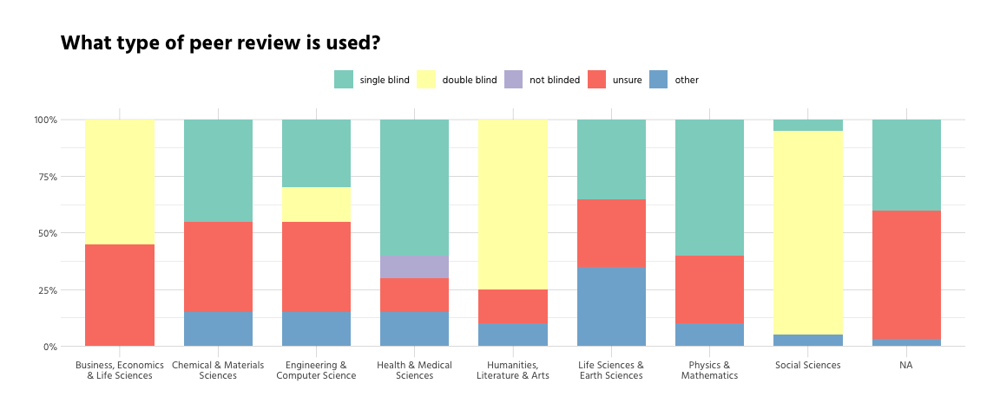
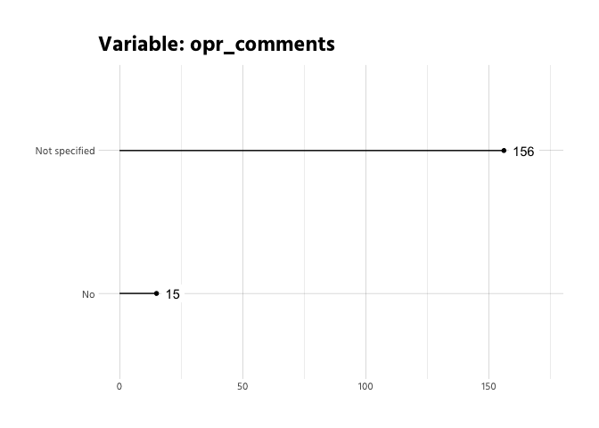
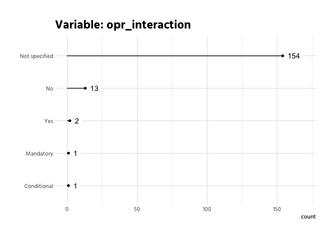
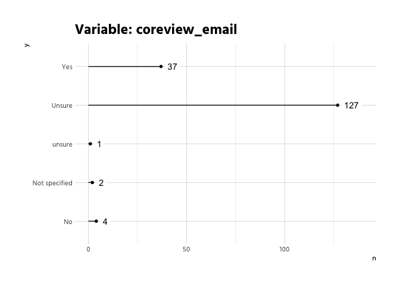
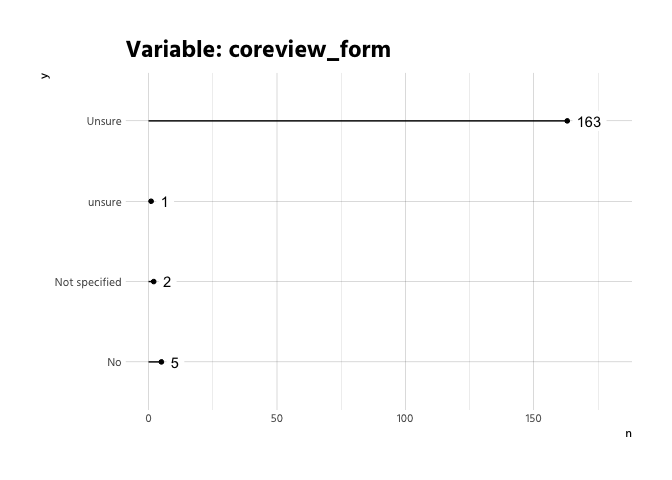
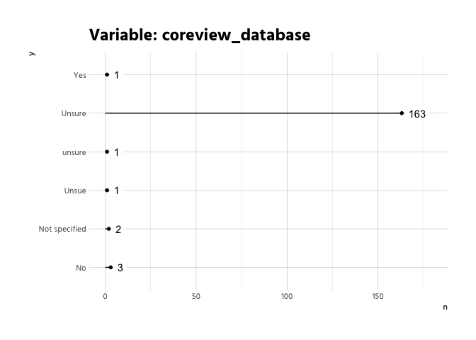
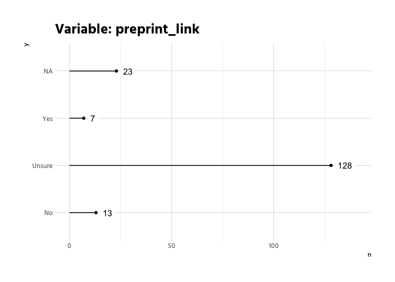

# General overview
<!-- -->

There is quite some missing data, which shouldn't be like this. For example
the field U30 in excel (table RAW), which has the opr-responses for the journal
"Advanced Materials" is missing. It should probably be "Not specified".

The following are all variables, where implicit missings should be checked and
converted to explicit ones (as for opr_responses), or fixed (as for publishers).

<!-- -->

# Peer Review

<!-- -->

<!-- -->

<!-- -->

# Open Peer Review
<!-- -->

<!-- -->

<!-- --><!-- --><!-- --><!-- -->

# Co-Review
Let's look at the co-review policy.

Only 87 out of 171 do have a 
coreview-policy.

The following table displays stemmed parts of the policies, sorted by propensity.

  

The following graph shows the relationship between to most common bigrams (only
bigrams that occur at least three times).

<!-- -->

<!-- --><!-- --><!-- -->

# Preprints
<!-- -->

<!-- --><!-- -->
