# Summary
The general impression is, that the journals most of the time do not have a 
specific policy regarding the aspect under question, or it was unclear for our
reviewers if there was a policy or not or how to interpret it.

# Missing data
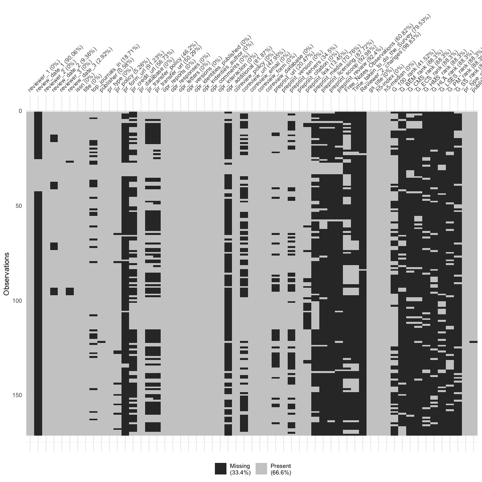<!-- -->

There is quite some missing data, which shouldn't be like this. For example
the field U30 in excel (table RAW), which has the opr-responses for the journal
"Advanced Materials" is missing. It should probably be "Not specified".

The following are all variables, where implicit missings should be checked and
converted to explicit ones (as for opr_responses), or fixed (as for publishers).

<!-- -->

# Publisher versus subject area
The question is, whether it is reasonable to split results by publisher.
I think it does not make much sense:

- There are not many publishers, that have multiple publications
- Except Springer Nature and Elsevier, most publishers are confined to one or 
two subject areas. Looking at publishers would misinterprete differences as
being due to the publisher when they are due to the subject area.
- The only thing to compare would be thus Springer Nature vs. Elsevier

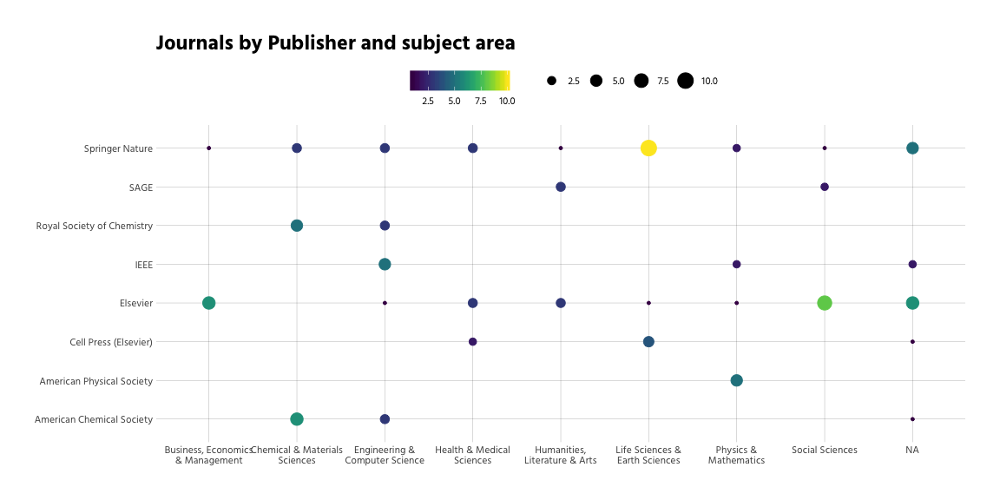<!-- -->

# Peer Review

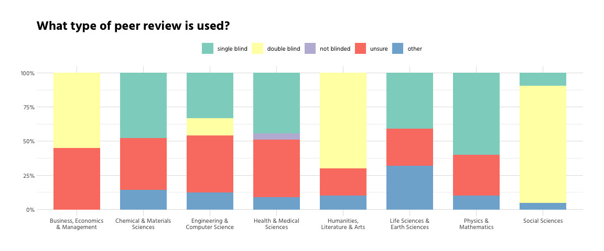<!-- -->

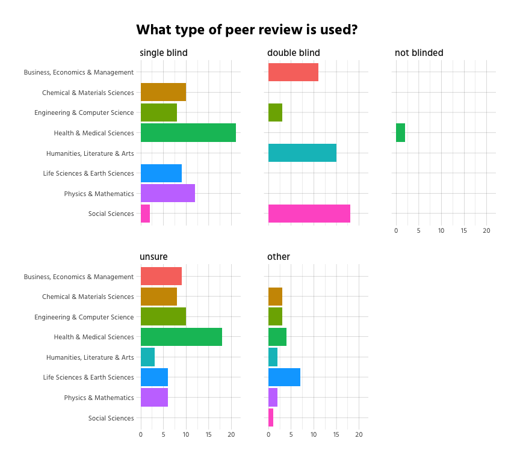<!-- -->

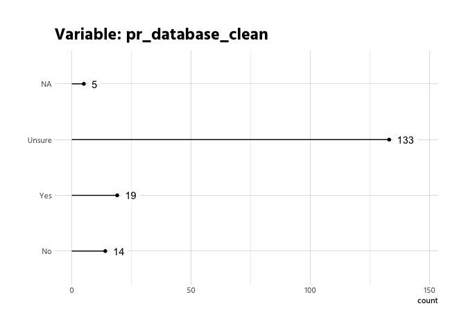<!-- -->

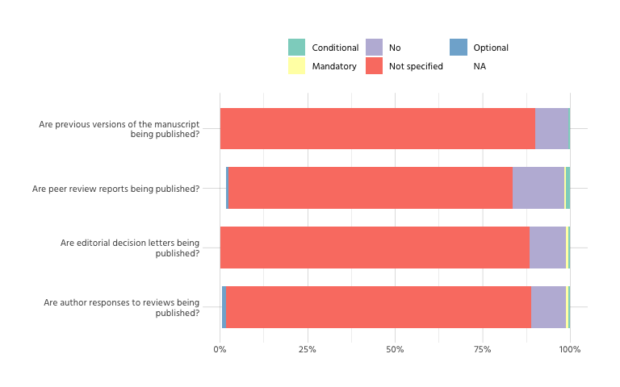<!-- -->

# Open Peer Review
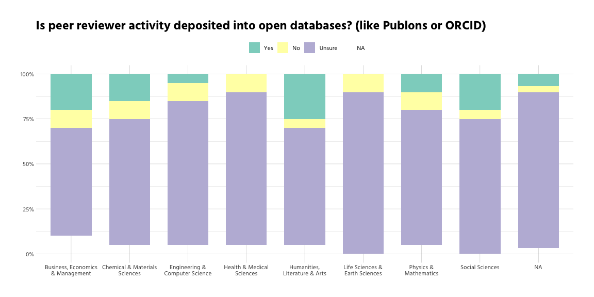<!-- -->

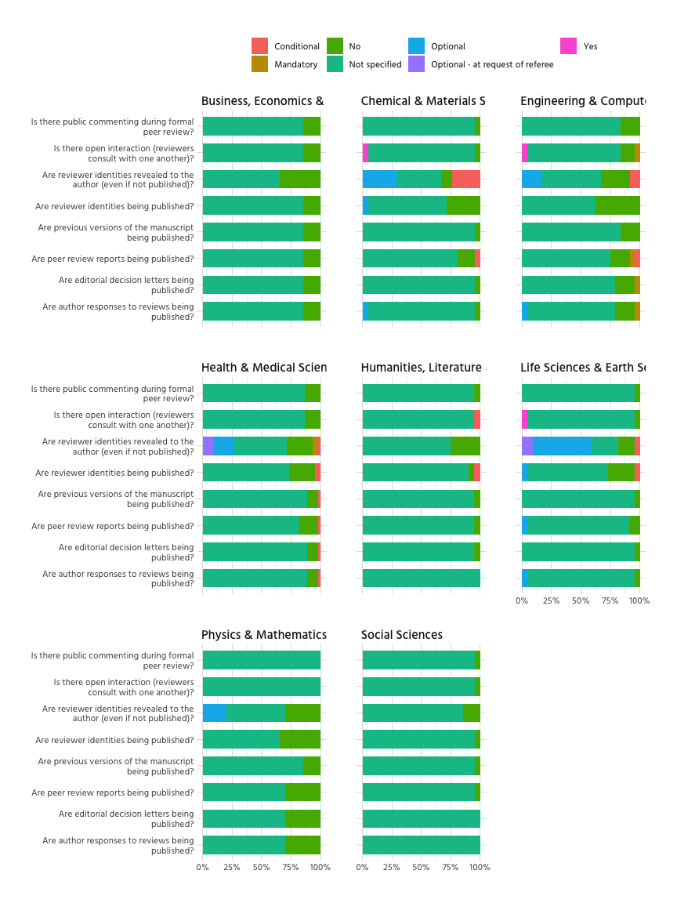<!-- -->

# Co-Review
Let's look at the co-review policy.

Only 87 out of 171 do have a 
coreview-policy. Due to policies being similar across journals of certain 
publishers, there are 45
distinct policies in our dataset.

The following table displays stemmed parts of the distinct policies, sorted by
propensity.

  

The following graph shows the relationship between to most common bigrams (only
bigrams that occur at least three times).

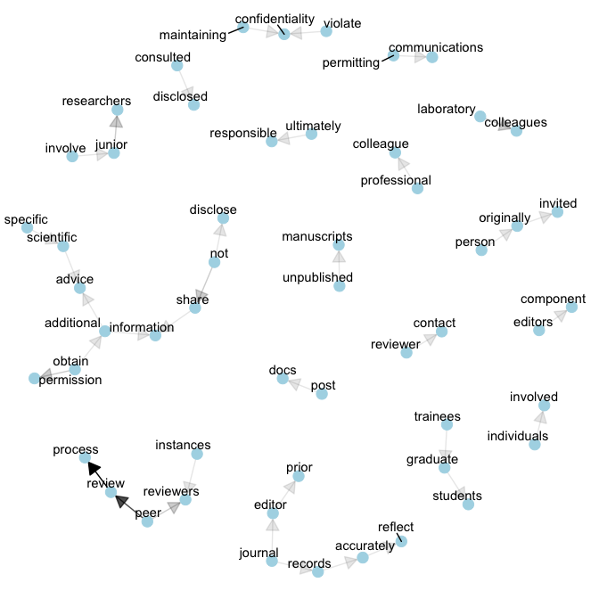<!-- -->

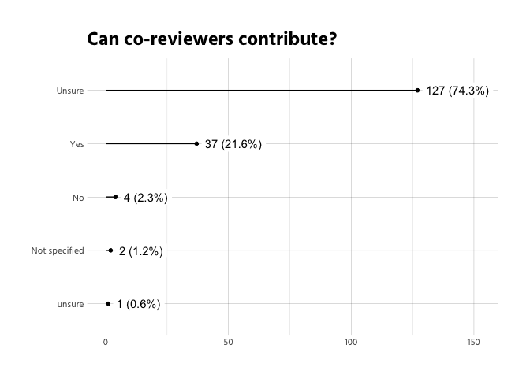<!-- -->

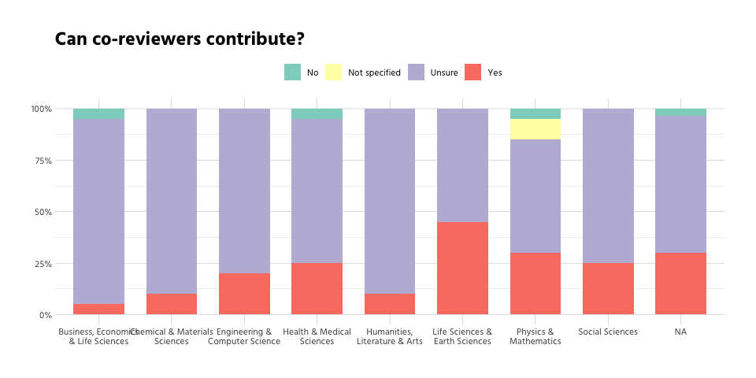<!-- -->

This doesn't look interesting.
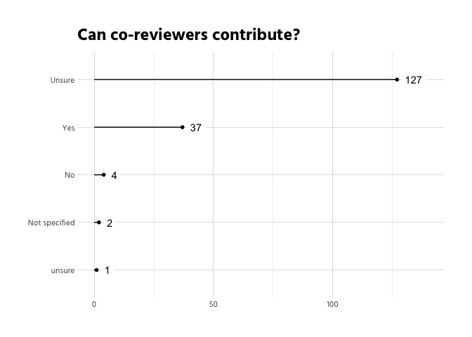<!-- -->

This doesn't look interesting.
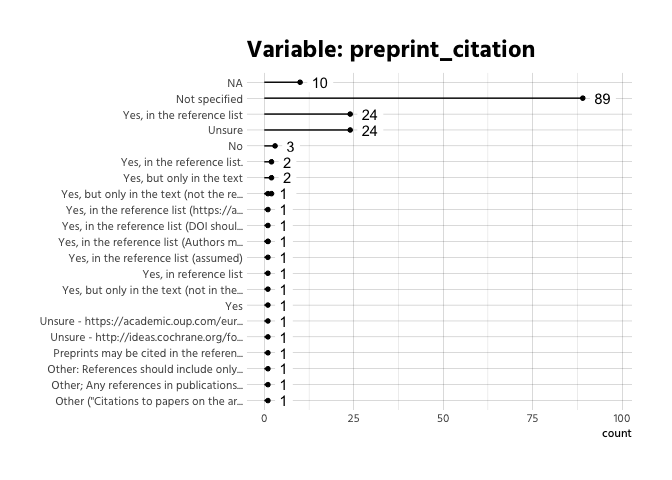<!-- -->

# Preprints
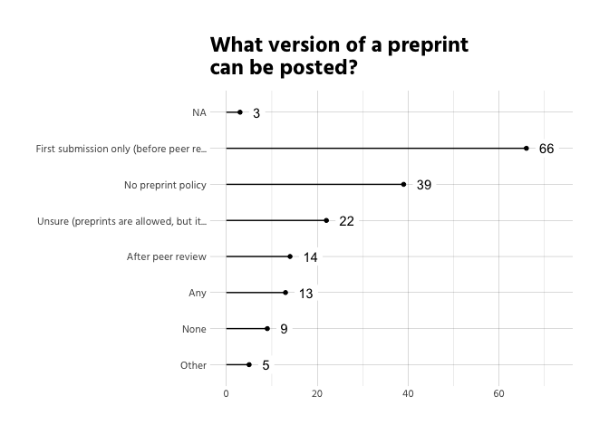<!-- -->

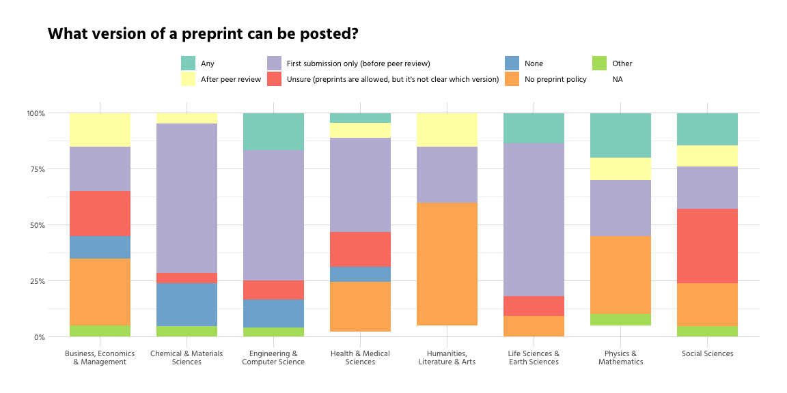<!-- -->

  

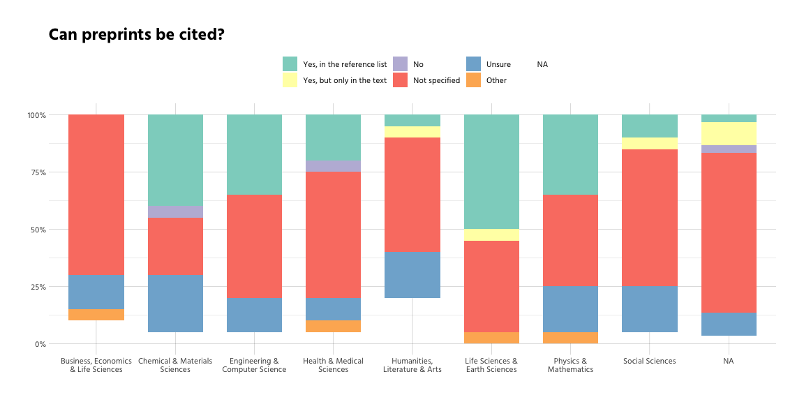<!-- -->

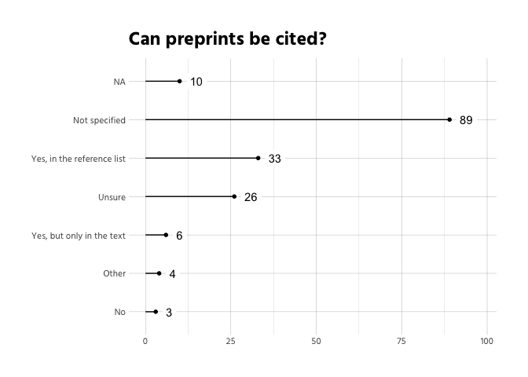<!-- -->

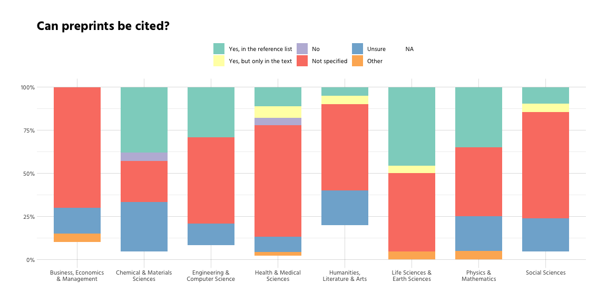<!-- -->

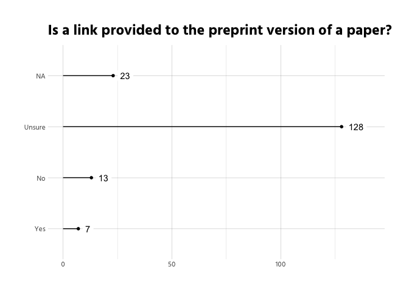<!-- -->

