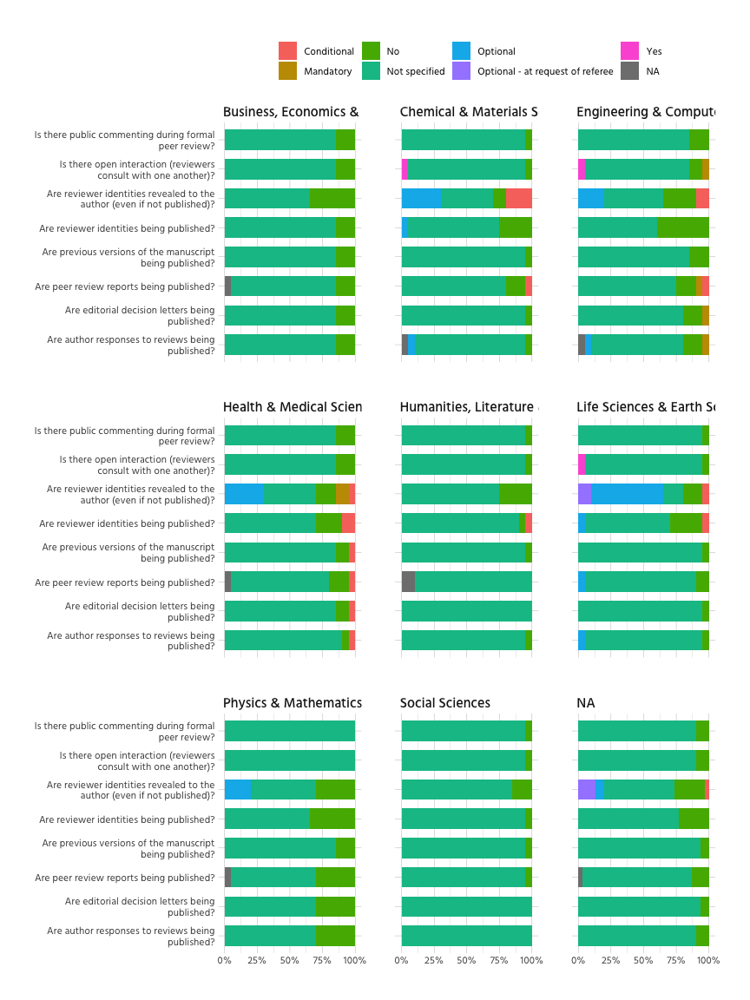

# General overview
<!-- -->

There is quite some missing data, which shouldn't be like this. For example
the field U30 in excel (table RAW), which has the opr-responses for the journal
"Advanced Materials" is missing. It should probably be "Not specified".

The following are all variables, where implicit missings should be checked and
converted to explicit ones (as for opr_responses), or fixed (as for publishers).

<!-- -->


# Peer Review


<!-- -->


<!-- -->


# Open Peer Review
<!--html_preserve--><div id="htmlwidget-b389c48ef281fc348106" style="width:1152px;height:576px;" class="plotly html-widget"></div>
<script type="application/json" data-for="htmlwidget-b389c48ef281fc348106">{"x":{"data":[{"orientation":"h","width":0.9,"base":0.994152046783626,"x":[0.00584795321637432],"y":[3],"text":"count: 0.005847953<br />label: Are peer review reports being published?<br />val: Conditional","type":"bar","marker":{"autocolorscale":false,"color":"rgba(248,118,109,1)","line":{"width":1.88976377952756,"color":"transparent"}},"name":"Conditional","legendgroup":"Conditional","showlegend":true,"xaxis":"x","yaxis":"y","hoverinfo":"text","frame":null},{"orientation":"h","width":[0.9,0.9,0.9,0.9],"base":[0.994152046783626,0.994152046783626,0.988304093567251,0.994152046783626],"x":[0.00584795321637432,0.00584795321637432,0.00584795321637421,0.00584795321637432],"y":[1,2,3,4],"text":["count: 0.005847953<br />label: Are author responses to reviews being<br />published?<br />val: Conditional; Free to read (not paywalled)","count: 0.005847953<br />label: Are editorial decision letters being<br />published?<br />val: Conditional; Free to read (not paywalled)","count: 0.005847953<br />label: Are peer review reports being published?<br />val: Conditional; Free to read (not paywalled)","count: 0.005847953<br />label: Are previous versions of the manuscript<br />being published?<br />val: Conditional; Free to read (not paywalled)"],"type":"bar","marker":{"autocolorscale":false,"color":"rgba(196,154,0,1)","line":{"width":1.88976377952756,"color":"transparent"}},"name":"Conditional; Free to read (not paywalled)","legendgroup":"Conditional; Free to read (not paywalled)","showlegend":true,"xaxis":"x","yaxis":"y","hoverinfo":"text","frame":null},{"orientation":"h","width":[0.9,0.9,0.9],"base":[0.988304093567251,0.988304093567251,0.982456140350877],"x":[0.00584795321637421,0.00584795321637421,0.00584795321637432],"y":[1,2,3],"text":["count: 0.005847953<br />label: Are author responses to reviews being<br />published?<br />val: Mandatory","count: 0.005847953<br />label: Are editorial decision letters being<br />published?<br />val: Mandatory","count: 0.005847953<br />label: Are peer review reports being published?<br />val: Mandatory"],"type":"bar","marker":{"autocolorscale":false,"color":"rgba(83,180,0,1)","line":{"width":1.88976377952756,"color":"transparent"}},"name":"Mandatory","legendgroup":"Mandatory","showlegend":true,"xaxis":"x","yaxis":"y","hoverinfo":"text","frame":null},{"orientation":"h","width":[0.9,0.9,0.9,0.9],"base":[0.888888888888889,0.883040935672515,0.83625730994152,0.900584795321637],"x":[0.0994152046783626,0.105263157894737,0.146198830409357,0.0935672514619883],"y":[1,2,3,4],"text":["count: 0.099415205<br />label: Are author responses to reviews being<br />published?<br />val: No","count: 0.105263158<br />label: Are editorial decision letters being<br />published?<br />val: No","count: 0.146198830<br />label: Are peer review reports being published?<br />val: No","count: 0.093567251<br />label: Are previous versions of the manuscript<br />being published?<br />val: No"],"type":"bar","marker":{"autocolorscale":false,"color":"rgba(0,192,148,1)","line":{"width":1.88976377952756,"color":"transparent"}},"name":"No","legendgroup":"No","showlegend":true,"xaxis":"x","yaxis":"y","hoverinfo":"text","frame":null},{"orientation":"h","width":0.9,"base":0.87719298245614,"x":[0.00584795321637432],"y":[2],"text":"count: 0.005847953<br />label: Are editorial decision letters being<br />published?<br />val: not specified","type":"bar","marker":{"autocolorscale":false,"color":"rgba(0,182,235,1)","line":{"width":1.88976377952756,"color":"transparent"}},"name":"not specified","legendgroup":"not specified","showlegend":true,"xaxis":"x","yaxis":"y","hoverinfo":"text","frame":null},{"orientation":"h","width":[0.9,0.9,0.9,0.9],"base":[0.0175438596491228,0,0.0233918128654971,0],"x":[0.871345029239766,0.87719298245614,0.812865497076023,0.900584795321637],"y":[1,2,3,4],"text":["count: 0.871345029<br />label: Are author responses to reviews being<br />published?<br />val: Not specified","count: 0.877192982<br />label: Are editorial decision letters being<br />published?<br />val: Not specified","count: 0.812865497<br />label: Are peer review reports being published?<br />val: Not specified","count: 0.900584795<br />label: Are previous versions of the manuscript<br />being published?<br />val: Not specified"],"type":"bar","marker":{"autocolorscale":false,"color":"rgba(165,138,255,1)","line":{"width":1.88976377952756,"color":"transparent"}},"name":"Not specified","legendgroup":"Not specified","showlegend":true,"xaxis":"x","yaxis":"y","hoverinfo":"text","frame":null},{"orientation":"h","width":[0.9,0.9],"base":[0.00584795321637427,0.0175438596491228],"x":[0.0116959064327485,0.00584795321637427],"y":[1,3],"text":["count: 0.011695906<br />label: Are author responses to reviews being<br />published?<br />val: Optional","count: 0.005847953<br />label: Are peer review reports being published?<br />val: Optional"],"type":"bar","marker":{"autocolorscale":false,"color":"rgba(251,97,215,1)","line":{"width":1.88976377952756,"color":"transparent"}},"name":"Optional","legendgroup":"Optional","showlegend":true,"xaxis":"x","yaxis":"y","hoverinfo":"text","frame":null},{"orientation":"h","width":[0.9,0.9],"base":[0,0],"x":[0.00584795321637427,0.0175438596491228],"y":[1,3],"text":["count: 0.005847953<br />label: Are author responses to reviews being<br />published?<br />val: NA","count: 0.017543860<br />label: Are peer review reports being published?<br />val: NA"],"type":"bar","marker":{"autocolorscale":false,"color":"rgba(127,127,127,1)","line":{"width":1.88976377952756,"color":"transparent"}},"name":"NA","legendgroup":"NA","showlegend":true,"xaxis":"x","yaxis":"y","hoverinfo":"text","frame":null}],"layout":{"margin":{"t":95.7011207970112,"r":39.8505603985056,"b":95.0435865504359,"l":370.809464508095},"font":{"color":"rgba(0,0,0,1)","family":"Hind","size":14.6118721461187},"xaxis":{"domain":[0,1],"automargin":true,"type":"linear","autorange":false,"range":[-0.05,1.05],"tickmode":"array","ticktext":["0.00","0.25","0.50","0.75","1.00"],"tickvals":[0,0.25,0.5,0.75,1],"categoryorder":"array","categoryarray":["0.00","0.25","0.50","0.75","1.00"],"nticks":null,"ticks":"","tickcolor":null,"ticklen":3.65296803652968,"tickwidth":0,"showticklabels":true,"tickfont":{"color":"rgba(77,77,77,1)","family":"Hind","size":11.689497716895},"tickangle":-0,"showline":false,"linecolor":null,"linewidth":0,"showgrid":true,"gridcolor":"rgba(43,43,43,0.6)","gridwidth":0.132835201328352,"zeroline":false,"anchor":"y","title":{"text":"","font":{"color":"rgba(0,0,0,1)","family":"Hind Medium","size":11.9551681195517}},"hoverformat":".2f"},"yaxis":{"domain":[0,1],"automargin":true,"type":"linear","autorange":false,"range":[0.4,4.6],"tickmode":"array","ticktext":["Are author responses to reviews being<br />published?","Are editorial decision letters being<br />published?","Are peer review reports being published?","Are previous versions of the manuscript<br />being published?"],"tickvals":[1,2,3,4],"categoryorder":"array","categoryarray":["Are author responses to reviews being<br />published?","Are editorial decision letters being<br />published?","Are peer review reports being published?","Are previous versions of the manuscript<br />being published?"],"nticks":null,"ticks":"","tickcolor":null,"ticklen":3.65296803652968,"tickwidth":0,"showticklabels":true,"tickfont":{"color":"rgba(77,77,77,1)","family":"Hind","size":11.689497716895},"tickangle":-0,"showline":false,"linecolor":null,"linewidth":0,"showgrid":true,"gridcolor":"rgba(43,43,43,0.6)","gridwidth":0.132835201328352,"zeroline":false,"anchor":"x","title":{"text":"","font":{"color":"rgba(0,0,0,1)","family":"Hind Medium","size":11.9551681195517}},"hoverformat":".2f"},"shapes":[{"type":"rect","fillcolor":null,"line":{"color":null,"width":0,"linetype":[]},"yref":"paper","xref":"paper","x0":0,"x1":1,"y0":0,"y1":1}],"showlegend":true,"legend":{"bgcolor":null,"bordercolor":null,"borderwidth":0,"font":{"color":"rgba(0,0,0,1)","family":"Hind","size":11.689497716895},"y":1},"hovermode":"closest","barmode":"relative"},"config":{"doubleClick":"reset","showSendToCloud":false},"source":"A","attrs":{"8c4c1140a877":{"x":{},"fill":{},"type":"bar"}},"cur_data":"8c4c1140a877","visdat":{"8c4c1140a877":["function (y) ","x"]},"highlight":{"on":"plotly_click","persistent":false,"dynamic":false,"selectize":false,"opacityDim":0.2,"selected":{"opacity":1},"debounce":0},"shinyEvents":["plotly_hover","plotly_click","plotly_selected","plotly_relayout","plotly_brushed","plotly_brushing","plotly_clickannotation","plotly_doubleclick","plotly_deselect","plotly_afterplot"],"base_url":"https://plot.ly"},"evals":[],"jsHooks":[]}</script><!--/html_preserve-->

<!-- -->


# Co-Review
Let's look at the co-review policy.


Only 87 out of 171 do have a 
coreview-policy.

The following table displays stemmed parts of the policies, sorted by propensity.

```
## # A tibble: 260 x 2
##    word           n
##    <chr>      <int>
##  1 review       135
##  2 manuscript    53
##  3 editor        44
##  4 confidenti    34
##  5 inform        25
##  6 colleagu      21
##  7 involv        17
##  8 journal       17
##  9 consult       15
## 10 discuss       15
## # … with 250 more rows
```


The following graph shows the relationship between to most common bigrams (only
bigrams that occur at least three times).

<!-- -->


# Preprints
