# Sample characteristics
The approach taken to create the sample of journals led to a few journals 
having no data on disciplinary area: some journals like "Gut" were within the 
top 100 journals, but not within any of the sub-categories. This is because the
h-index varies greatly between sub-categories. Figure \@ref(fig:h-indices)
shows the top-20 journals of each discipline.

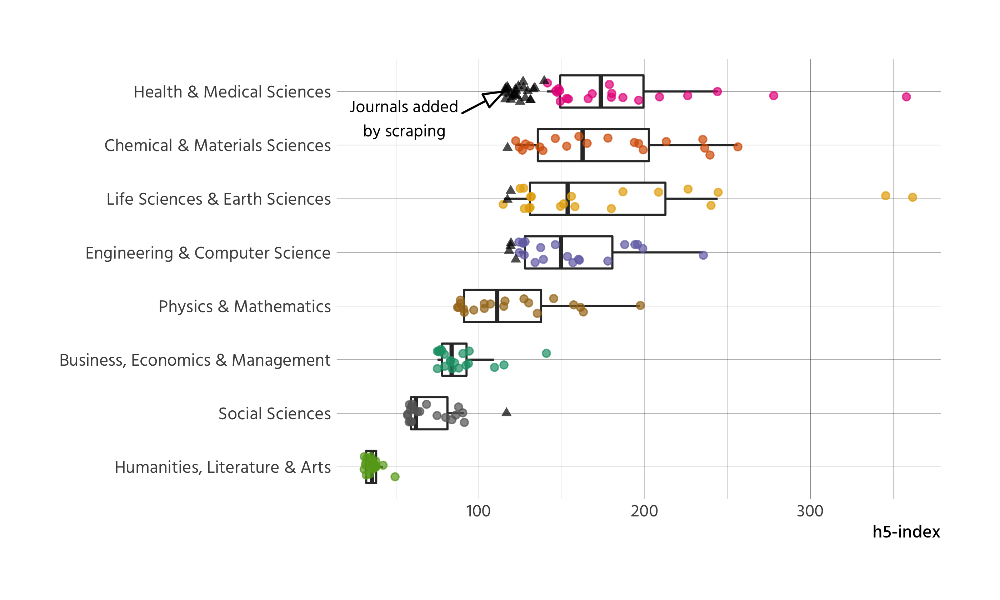

(\#fig:h-indices)Distribution of h5-index across disciplines

The missing categorisations were added in a second step, to facilitate analysis 
of all journals that distinguishes by discipline. To this end, we scraped all 
disciplines and sub-disciplines from Google Scholar and matched those to our data.
^[The code for collecting the data from Google Scholar can be found here:
ADD LINKS HERE TO DATA AND SCRIPT]

As stated, the criteria for inclusion into the Google Scholar rankings are opaque
and non-reproducible. For example it is possible for a journal to be included in
different disciplines, which makes a lot of sense
(for example "Physics & Mathematics" along with 
"Engineering & Computer Science"). It is however also possible for a journal to
be included in a sub-discipline, and not in the parent discipline, despite 
having a higher h-index than all journals listed in the parent discipline.^[As
of 2019-07-02, the "Journal of Cleaner Production" is listed in the social 
sciences under "sustainable development"
(https://scholar.google.at/citations?view_op=top_venues&hl=en&vq=soc_sustainabledevelopment). 
But it is not listed under the parent category 
(https://scholar.google.at/citations?view_op=top_venues&hl=en&vq=soc).]

The nature of our selection means that 
22 out of 171 journals are assigned to two
disciplines. The inclusion criteria further mean, that disciplines are not 
represented equally in the sample. Since many of the top 100 journals belong to 
the health and medical sciences, the sample is slightly skewed in that direction
(see figure \@ref(fig:sample-skew)).

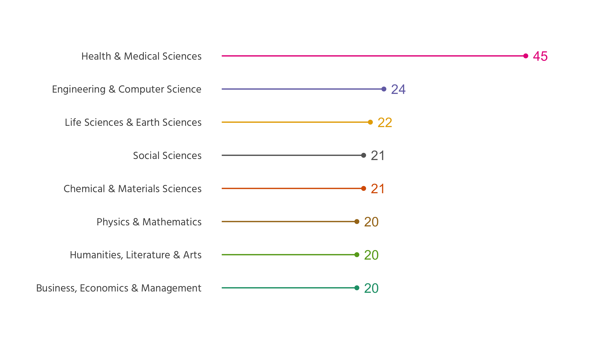

(\#fig:sample-skew)Sampled journals by discipline

Regarding practices of open access, only 8 of 
171 journals are listed in the Directory of Open Access 
Journals (DOAJ) and can thus be considered fully open access. ^[Code and data 
for querying the DOAJ API and matching to our data can be found here FIXME]

# Peer Review

Information on what type of peer review is used by a journal is mixed 
(see figure \@ref(fig:pr-type-overall)).
Overall, more than 30% of all journals do not provide clear 
information about their peer review process. The most common peer review 
practice is single blind per review, followed by double blind peer review.
Some journals offer the option for authors to 
choose whether to use single or double blind peer review. These cases have been
coded as "Other" and amount to the majority of this category. 1% 
journals do not anonymize papers or reviews during review process.

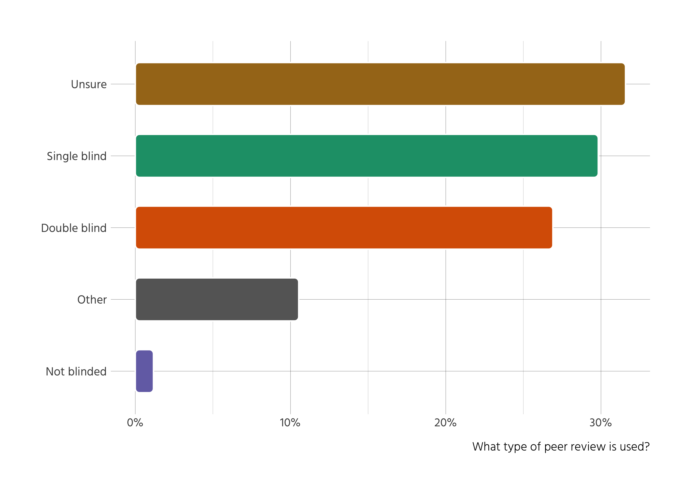

(\#fig:pr-type-overall)Type of peer review

However, there are major differences between disciplines (see figure 
\@ref(fig:peer-type)). In the social sciences, humanities, and business, double
blind peer review is generally the norm, while in the natural sciences it is
single
blind peer review. Business, economics & management displays the highest level
of unclear policies, with social science and humanities being very clear and the
other sciences somehwere in between. 

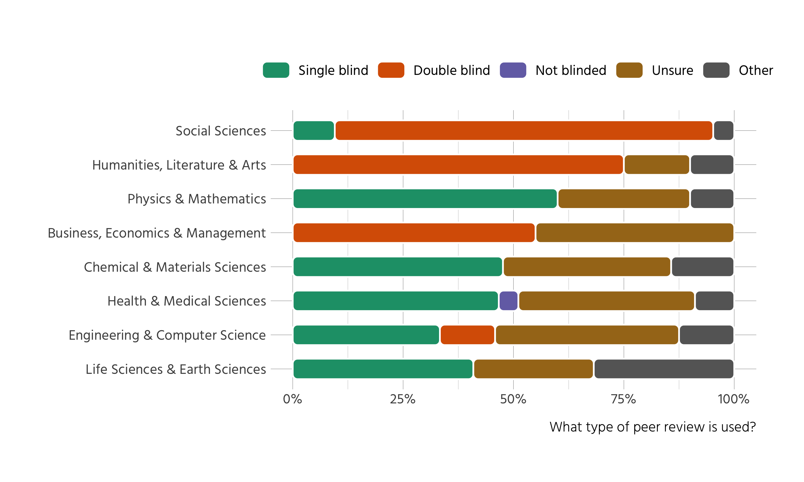

(\#fig:peer-type)Type of peer review by discipline

When it comes to recognition of peer review activity, only 11% of
all journals deposit reviewer activity into open databases. Furthermore,
the majority of journals (81%) does not state at all whether peer 
review activity is deposited in any kind of database, open or not. The remaining
8% of journals deposit reviewer activity into databases which are not 
open. 

# Open Peer Review

Information on open peer review is similarly scarce (see fig. \@ref(fig:opr)). 
The survey included questions on common dimensions of open peer review, like
whether peer review reports, editorial decision letters or previous versions of
the manuscript are published, or whether there is public commenting during peer
review, and similar questions. All surveyed aspects of 
open peer review lack any kind of information in more than 50% of journals 
surveyed. 
Furthermore, three quarters of journals do not provide information on all except
one aspect. When there is information, in most cases it is 
dismissive of open peer review. No journal in our sample allows public 
commenting during formal peer review. Other forms of openness are similarly 
scarce. With the sole exception that some journals may reveal reviewer 
identities to the authors, all other aspects are not specified or not
available in more than 95% of journals.

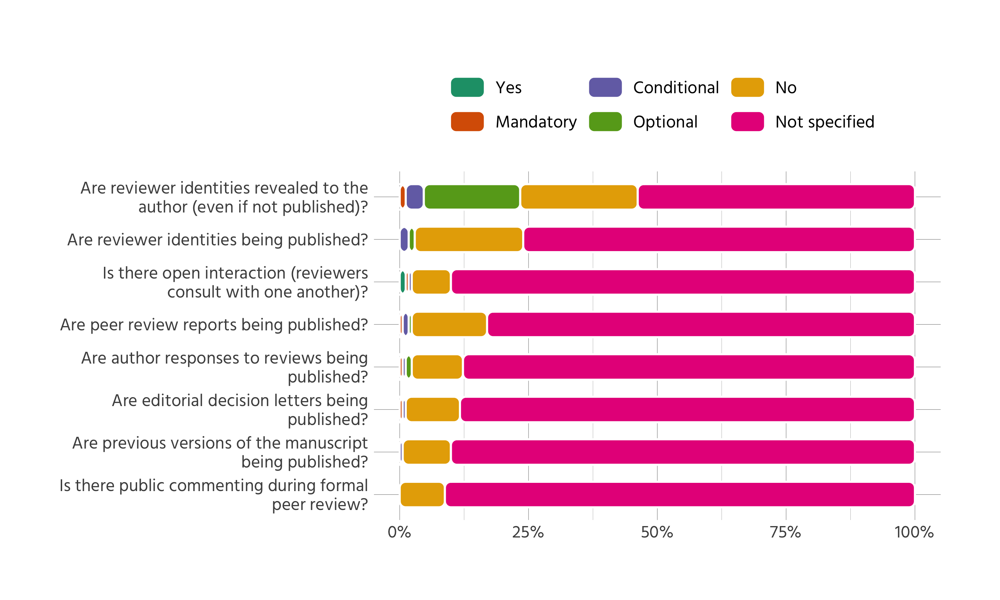

(\#fig:opr)Aspects of open peer review

Since the aspect of revealed reviewer identities is the only one with 
substantive variation, we also examine it for each discipline separately
(see fig. \@ref(fig:opr-authors)). Whereas revealing reviewer
identities to the authors is absent from the social sciences, humanities and
business in the investigated subset of journals, it is not unusual in the
sciences, at least on an optional basis 
(for example in case the referee wants to sign their review). 

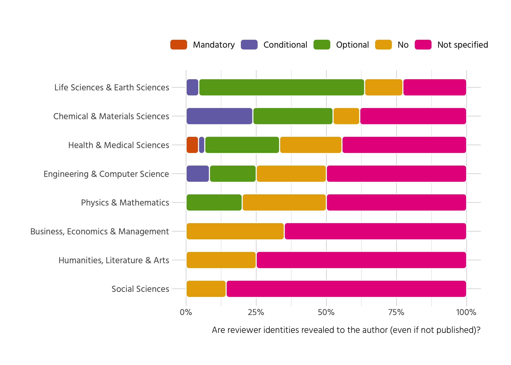

(\#fig:opr-authors)Open reviewer identities towards authors

TODO: explain differences between Yes, Mandatory, Conditional, Optional. Tony to
check and explain.

# Co-Review Policy

Information on co-review policies is sparse. 
Only 87 out of 171 journals do have an
explicit co-review policy.

Splitting the results by discipline
reveals noticeable differences (see fig. \@ref(fig:co-rev)).
While in the life and earth sciences, health & medical sciences as well as 
physics & mathematics more then a quarter of journals permit contributions 
from co-reviewers, in the 
humanities, chemical & materials sciences, and in business, economics & 
management about 90% of journals have no policy on co-reviewing.

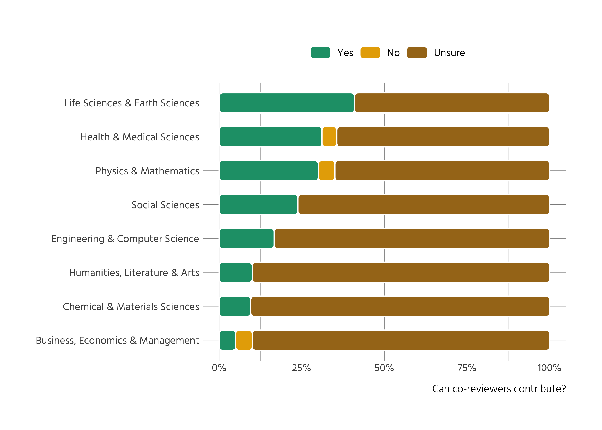

(\#fig:co-rev)Prevalence of co-review

To obtain a more nuanced view of the policies' contents, we also analysed their
full text via text mining. Due to policies being similar across journals of 
certain publishers, there are 45
distinct policies in our dataset (compared to 87 
policies in total). Since the policies are rather short, we are 
somewhat limited in regard to what insight we can gain from automated 
procedures.

To extract meaningful information we first removed common words of the English
language (via the list of stop-words from the tidytext package
[@silge_tidytext_2016], except for the word "not", which is relevant since some
policies state, that it is *not* appropriate to share information with students
or colleagues). The resulting list contains 1151 words in 
total. 

For a simple overview, the words were stemmed to reduce similar but not 
identical versions of certain words (like editor/editors).
Table \@ref(tab:coreview-table) displays the most frequent parts of the
distinct policies, sorted by the proportion of policies that contain a given
term.

Table: (\#tab:coreview-table)Propensity of terms in co-review policies

Term          Term frequency  Proportion of policies that contain term 
-----------  ---------------  -----------------------------------------
review                   135  94%                                      
editor                    44  75%                                      
manuscript                53  73%                                      
confidenti                34  63%                                      
not                       30  59%                                      
inform                    25  51%                                      
colleagu                  21  45%                                      
journal                   17  35%                                      
involv                    17  35%                                      
discuss                   15  32%                                      
consult                   15  31%                                      
permiss                   14  31%                                      
peer                      13  28%                                      
student                   14  27%                                      
author                    13  27%                                      
disclos                   14  27%                                      
process                   12  26%                                      
ensur                     11  24%                                      
person                    11  24%                                      
obtain                    11  23%                                      

The most prominent themes that emerge are:

- Individuals with varying stakes regarding peer review: editor, colleague, 
author, student, peer.
- Confidentiality as a central principle.
- Important elements of scholarly publishing: manuscript, journal, review, 
process.
- Verbal forms pertaining to relationships between the individuals: inform,
involve, consult, discuss, disclose, ensure, obtain.

These directions become more intelligible when we look at bigrams (see fig.
\@ref(fig:bigrams)). With this procedure the text is
split into pairs of words (for example the sentence "All humans are equal" 
becomes "All humans", "humans are", "are equal"). The most prominent bigrams 
where "peer -> review" and "review -> process". To take a look at the strength 
of other associations, the term "review" was removed from the figure. The 
strength of association in the figure is depicted by bold arrows, which are more
common than the others.

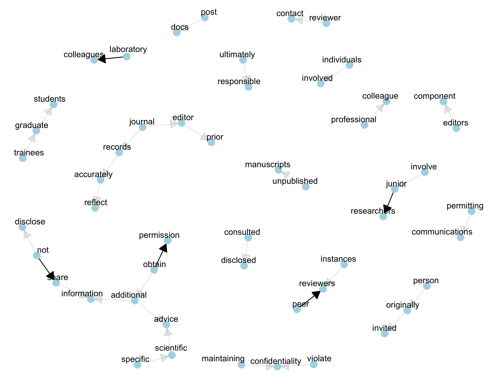

(\#fig:bigrams)Bigrams of co-review policies

From both displays it is obvious, that journals stress the importance of 
"maintaining confidentiality", by "not shar[ing]" or disclosing information,
neither to "junior researchers", "laboratory colleagues" nor "graduate 
students". Even if the policies do not explicitly forbid or allow the 
involvement of other researchers, in many cases they mandate the reviewer to 
first obtain permission from the editor in case they want to involve someone
else in their review. The editor's prominent role can also be observed by the 
terms' frequent appearance in the policies. Three quarters of all policies
mention the term "editor". 

# Preprints

Preprints are more common within our sample than open peer review or co-review
policies. Almost
70%
of all journals allow preprints at least in some way. Most of them however only
allow preprints before peer review 
(39%)
while 
23%
do not have a preprint policy.

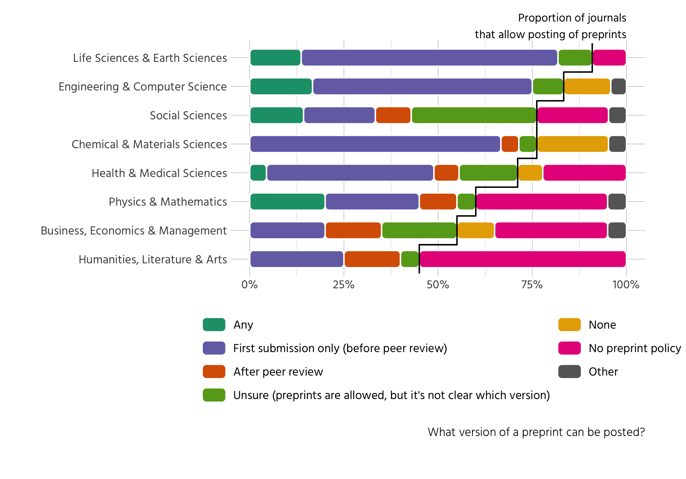

(\#fig:preprint-version)Allowed preprint versions

Similar to our earlier results, preprint policies show a wide disciplinary 
range (see fig. \@ref(fig:preprint-version)). While in the life sciences & earth 
sciences 
90%
of all journals allow preprints in some way, in the Humanities only 
45%
do.
The natural sciences in general tend towards allowing preprints only on first submission
while the social sciences predominantly have no clear policy on which version of
a preprint is allowed. 
The humanities and also journals from business, economics and management 
generally have either no preprint policy at all or are more diverse in regard to
preprint version, often allowing preprints after peer review, which is a lot 
less common in the natural sciences.

A complementary aspect of using preprints is, whether they can be cited. The
majority of journals
(57%)
does not specify, whether this is possible. Unclear policies on how to cite
preprints are also quite 
common (15%). In case
citations of preprints are allowed, this is commonly possible in the reference,
with some journals restricting citations of preprints to the text.

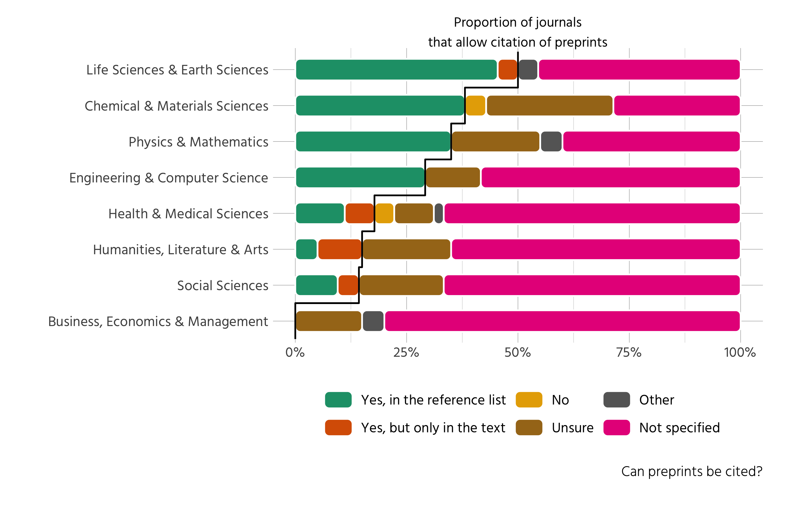

(\#fig:preprint-citation)Citation of preprints

Disciplinary differences are again very apparent (see fig.
\@ref(fig:preprint-citation)). Citing preprints is more common in the natural
sciences, with 
50%
of all journals in the life and earth sciences allowing citations to preprints
either in the text or in the reference list. In contrast, the social sciences 
and humanities either have unclear or no policies regarding whether preprints 
can be cited or not. 

# The Landscape of Open Science Practices
Results so far have revealed that in many cases policies are unclear. But in
which ways are policies related to each other? Do journals that allow co-review
also allow preprints? Is there a gradient between journals that are pioneers in
regard to open science, and others that lag behind? Or are there certain groups
of journals, open in one area, reluctant in the second and maybe unclear in the
third?

To answer these question, we employ Multiple Correspondence Analysis (MCA). 
The technique allows us to explore the different policies jointly
[@greenacre_multiple_2006, 27] and thus paint
a landscape of open science practices among journals.

To facilitate interpration of the figures, variables had to be recoded. 
Categories with low counts were merged. Where feasible, we focused on whether 
certain  policies were clear or not, thus omitting the subtle differences within
the policies (for example whether journals allowed citations of preprints was 
simplified for whether the policy was clear (references allowed in text, 
reference list or not allowed) versus unclear (unsure about policy, no policy 
and other)). 

It should be noted that the procedure is strictly exploratory. We are exploring,
not testing any hypothesis.

We included the following active categories:

- Type of peer review.
- Whether there is a clear policy for coreview or not.
- Whether there is a clear policy for if reviewer identities are revealed to the 
authors
- Whether there is a clear policy for posting preprints or not.
- Whether there is a clear policy for citing preprints or not

The geometric layout of the space displayed in figure \@ref(fig:plot-mca) is 
determined by these five active categories. Interpretation of the points 
displayed is done by projecting them onto the axes. Furthermore, only statements
regarding the average are possible. From the previous sections it is apparent 
that policies in general are not very clear. Thus all interpretations pertain 
only to whether a given group of journals is above or below average within our
sample.
To further illuminate some of the results,
the disciplinary areas and the two most common publishers (Elsevier and Springer
Nature) were added as passive categories. They have no influence on the 
geometric layout but allow us to draw conclusions which practices are more 
prevalent in one area or another.

Numerical output from the MCA is shown in table \@ref(tab:mca-table). We can
see, that the contribution to the geometric layout is highest for the types of
peer review, policies for citing prepreints and whether reviewer identities are
revealed to authors (column inertia). 
These are also the strongest contributors to the first
dimension of the space, which explains 67.8% of total variance. The second
dimension which explains 6.9% of total variance is mainly driven by whether 
there is a clear policy on coreview, and to some extent by type of peer review.
We do not consider more than two dimensions since they do not account for much
of the residual variance.

Considering figure \@ref(fig:plot-mca), we can conclude that there exists a 
clear opposition in our data between journals that are above average in regard 
to clear policies on citing and posting preprints and whether
reviewer identities are revealed to authors or not. These journals also tend 
to have single blind policies regarding peer review or "Other" types of peer
review. These other types of peer review are (with three exepctions) all 
journals from Springer Nature. On the other side of the spectrum there are 
journals which are above average in regard to unclear policies, that tend to 
follow the policy of double blind peer review. Regarding disciplinary area,
there is a clear divide between journals from the SSH and all other disciplines.
Journals from the SSH have on average less clear policies than their 
counterparts from the natural sciences.

The second dimension, mainly driven by the distinction whether journals have a
clear policy on whether coreviewers can contribute or not, is of less importance
compared to the first dimension. Journals from the Life and Earth Sciences,
Physics & Mathematics as well as Health & Medical Sciences are above average in
regard to how clear their coreview policies are. Journals from Chemical & 
Materials Sciences, Engeneering & Computer Science and especially the journals 
from the SSH are below average in this regard.

Table: (\#tab:mca-table)Numerical output from Multiple Correspondence analysis

name                                           mass   inertia    k=1   correlation with dim 1   contribution to dim 1    k=2   correlation with dim 2   contribution to dim 2
--------------------------------------------  -----  --------  -----  -----------------------  ----------------------  -----  -----------------------  ----------------------
Coreview ??                                     151        27     20                       42                       1     71                      522                     107
Coreview ++                                      49        84    -62                       42                       3   -220                      522                     332
Posting preprints ??                             72        76    251                      769                      65    -29                       10                       9
Posting preprints ++                            128        42   -140                      769                      36     16                       10                       5
Citing preprints ??                             147        37    172                      821                      63    -23                       14                      11
Citing preprints ++                              53       103   -479                      821                     175     63                       14                      30
Reviewer identities revealed to authors          52       110   -525                      780                     207    -78                       17                      45
Reviewer identities not revealed to authors     148        39    184                      780                      72     27                       17                      16
Single blind                                     64        75   -126                      268                      15   -145                      357                     191
Double blind                                     49        94    359                      686                      91     56                       17                      22
Not blinded                                       2       102   -303                      100                       3   -541                      320                      86
Peer review ??                                   62        74    173                      656                      27     52                       59                      24
Other type of peer review                        23       137   -859                      688                     243    196                       36                     124
Business, Economics & Management                 NA        NA    521                      794                      NA    229                      153                      NA
Chemical & Materials Sciences                    NA        NA   -381                      678                      NA     47                       10                      NA
Engineering & Computer Science                   NA        NA    -97                      131                      NA     98                      132                      NA
Health & Medical Sciences                        NA        NA    -80                       68                      NA   -234                      576                      NA
Humanities, Literature & Arts                    NA        NA    437                      450                      NA    280                      186                      NA
Life Sciences & Earth Sciences                   NA        NA   -593                      964                      NA   -101                       28                      NA
Physics & Mathematics                            NA        NA    -88                      113                      NA   -169                      421                      NA
Social Sciences                                  NA        NA    458                      456                      NA    125                       34                      NA
Elsevier                                         NA        NA    355                      785                      NA    168                      176                      NA
Springer Nature                                  NA        NA   -942                      818                      NA    281                       73                      NA
Other publishers                                 NA        NA    120                      438                      NA   -107                      348                      NA

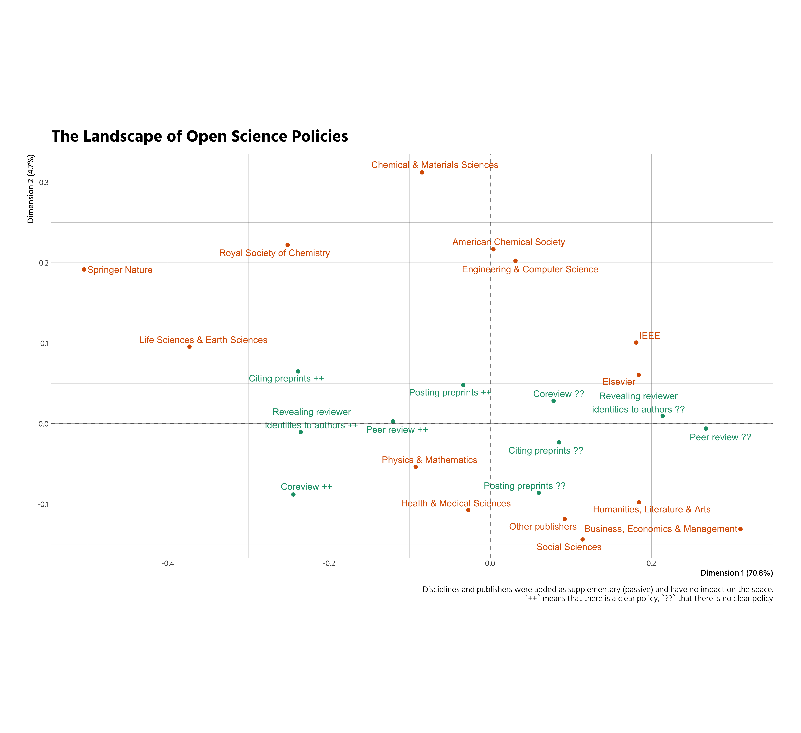

(\#fig:plot-mca)Joint analysis of open science practices

# Discussion
## Influential role of editor
The editor's role in all this is higly influential, with a lot of leeway.
Flexibility is good, uncertainty is bad.

Recall figure 
\@ref(fig:opr-authors), where we investigated whether reviewer identities are
revealed to authors, even if they are not made public. The high 
proportion of journals within SSH that are categorised as "not specified" might
be surprising, given that most of them conduct double blind peer review. One 
could thus infer, that reviewer identities are not revealed to the author. This
inference however is the root problem: there are no clear policies. Reviewers
might sign their review or not, what the authors receive is at the editor's 
discretion. 

## Unclear policies
this is bad, because ...

# Bibliography

